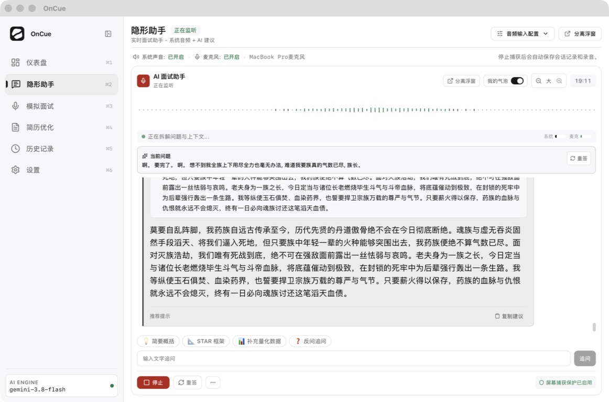
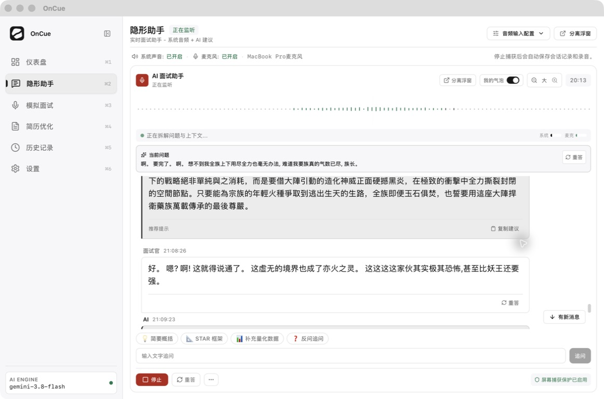
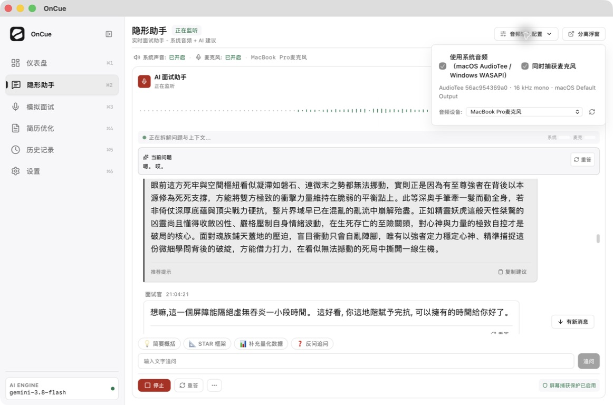

# 隐形助手 UI/UX 与聊天滚动性能审查

审查日期：2026-09-05。源码：`f46f5f5`，工作区 package 版本 `0.15.0`。实机：`/Applications/OnCue.app`，Info.plist 版本 `0.15.0`，原生 Tauri 页面 `tauri://localhost`。安装包与工作区版本一致，但未验证安装包对应的 Git commit。

以下为修改前的审查记录；后续优化见 [修改与验收记录](IMPLEMENTATION.md)。审查阶段未修改产品代码。截图来自本轮正在运行的应用，均已保存并重新打开检查。进入时应用已在录音；操作仅包含查看、滚动、打开/关闭音频配置，结束时已回到最新消息且仍在监听。没有发送追问、触发重答、改变设置或停止会话。

## 结论

优先减少更新触及的范围，再处理长列表挂载与阅读空间。当前存在完整的性能放大链路：音量/流式回答更新 → 整个 Copilot snapshot 变化 → 页面和面板重渲染 → 全量分组与提示提取 → 所有消息参与 React 渲染。长会话还叠加二次复杂度排序、完整 snapshot 广播和恢复快照写入。

这些代码路径已确认，足以指导优化次序；尚无 React commit trace 或逐帧时间线，不能断言每项对用户所述严重卡顿的占比。首次完整 AX 快照含 51 条消息（25 条面试官、25 条 AI、1 条我的消息），后续观察达到 72 条。该规模下单独分组的 Node 开销很小，因此不能仅以长列表算法解释本次现场卡顿。

## 本轮流程与截图

1. **实时聊天，需改进**：状态、角色、当前问题清晰；聊天视口偏小，核心提示重复正文。

   

   1162 × 768 截图中，聊天滚动区约从 y=339 到 y=634，高约 295 像素，约为整个窗口高度的 38%。顶部重复的标题/状态/分离浮窗入口，以及独立的波形和状态条，挤占阅读空间。已有侧栏折叠能力，可直接用于专注布局。

2. **向上阅读历史，需改进**：能够离开底部阅读旧消息，回底按钮可用；按钮把“离开底部”标成“有新消息”。

   

   首次向上滚动前后最新回答均为 21:09:53，按钮已出现。后续会话确有新消息到来，应区分这两种状态。当前问题保持置顶有利于跟踪现场，但历史内容与实时问题需要更明确的语境区分。

3. **打开音频配置，基本可用，说明不足**：会话中禁用切换可避免打断录音，Escape 可关闭；禁用原因没有写出来。

   

   弹层把 AudioTee commit、采样率、WASAPI 与用户设备选择放在同一层级。建议默认显示“系统声音”“麦克风”“输入设备”，并明确“录音进行中，停止后可更换设备”；技术诊断信息放入详情。

未操作启动/停止、真实模型追问、清空、浮窗、深色模式和系统权限；这些流程不属于本轮已验证的 UI 范围。

## 性能发现与建议

P0 表示首轮应处理，P1 表示紧随其后；严重程度是优化次序，不代表已经测得的耗时占比。

| 优先级 | 发现与证据 | 建议 | 验收要点 |
| --- | --- | --- | --- |
| P0 | `CopilotPanel.tsx:163` 和 `StealthCopilot.tsx:25` 都订阅整个 `copilot`；面板的秒表、输入框、复制反馈也与消息列表同层。Rust 已有 50 ms 音量间隔和前端 0.01 变化阈值，但保留下来的每个音量更新仍改变 snapshot。 | 波形/音量计独立订阅 amplitude，页头只订阅 phase/hasRecording 等所需字段；把秒表、输入区和聊天列表隔离。稳定历史行使用 memo，避免传入每次新建的无关对象和回调。 | 只有音量或秒表变化时，历史消息行的 React commit 数为 0；输入追问不应重算历史分组。 |
| P0 | `CopilotPanel.tsx:655–801` 全量 map，没有虚拟化；`extractKeyTakeaways()` 对单段文本返回整段，默认展开后与 `message.text` 再显示一次。截图 1 与独立探针均复现重复。 | 首先消除重复的核心提示；只对真实要点展示摘要。针对长会话采用支持变高行的可视区渲染，保留所有消息数据，仅限制挂载范围，预留上下缓冲。 | 旧记录仍全部可达、可归档；100/500/1000 条消息时 DOM 数随视口变化，不随历史线性增长；字号变化、折叠、流式续写无空白或跳位。 |
| P1 | `copilotSessionState.ts:116–168` 每个回答使用 `messages.find`，每个问题又扫描全数组收集回复，最坏为 O(n²)；`groupCopilotMessages()` 在每次面板 render 中调用。 | 用 Map 一次建立问题索引与回复分组，保持当前 replyToId、原始顺序、孤立回答与追问语义；由 messages/showMyBubbles 变化驱动 memo，避免音量更新重复运行。 | 消息量加倍时扫描量接近两倍；错序回答、重答、追问、自身气泡隐藏的既有检查继续通过。 |
| P1 | 两条 LLM `onDelta` 路径直接 `transition`（`copilotSession.ts:1136`、`:1275`）；`useLayoutEffect` 在 messages 改变后读取 scrollHeight 并写入 scrollTop。主窗口音量事件保留 messages 引用，所以并非每次音量都执行该 effect。 | 前台与后台回答共同合并 UI 提交，先试 30–50 ms 窗口，并立即提交最后一个 chunk；自动跟随统一到一处，按帧合并读写，只在贴底时工作。不要对每个 chunk 启动 smooth scroll。 | 流式回答时上翻位置稳定；首字延迟不明显增加，尾字不丢；底部跟随稳定。 |
| P1 | 每次 `publish()` 无条件 `emit(SNAPSHOT_EVENT, this.snapshot)`；`scheduleRecoverySave()` 由任意更新触发，800 ms 后全量 JSON 保存，未检查消息是否变化（`copilotSession.ts:451–475`）。 | 音量走轻量通道；文本/状态同步合并；恢复快照仅对可恢复内容变更置脏，保留周期保存与停止时最后写入。先拆音量，暂不设计复杂事件总线。 | 只有音量变化时，完整聊天快照广播和恢复 DB 写入为 0；恢复能力不退化。 |
| P1 | 浮窗客户端接收完整 snapshot 并整体替换 store（`copilotSession.ts:1421–1428`）。序列化边界产生新数组/新对象，主窗口的引用复用优势无法自动传过去。 | 浮窗同步只处理需要变化的部分，保留未变消息的对象身份；隐藏视图可暂停视觉更新，重新显示时拉取快照。不要停掉会话 host 或录音。 | 主窗口、浮窗分别测；一个回答增量只更新对应行，隐藏浮窗不持续渲染列表。 |
| P1 | 分组 key 是所有消息 ID 拼接（`CopilotPanel.tsx:665`）。问题单独出现时 key 为 `1`，回答加入后变成 `1-2`，React 将整个组视为新组。 | 使用稳定问题/组锚点 ID；明确处理隐藏追问与孤立回答的组身份。 | 回答首次插入和再次生成时问题行不重新挂载；键盘焦点、文本选择、折叠状态与阅读位置稳定。 |

React 官方文档明确：memo 只有在 props 不变时才有机会跳过渲染，组件自身 state/context 更新仍会触发；`useLayoutEffect` 在绘制前执行，会阻塞绘制。这里应缩小订阅与提交范围，保留需要的滚动定位时机，不能只把整个面板包一层 memo 或机械替换所有 layout effect。参考：[memo](https://react.dev/reference/react/memo)、[useLayoutEffect](https://react.dev/reference/react/useLayoutEffect)。

补充：正文当前使用纯文本；主要排查对象是状态更新、分组、节点挂载及布局调度。波形已使用 Canvas，并非每根柱子一个 React 节点；仅删除波形视觉未必消除整个面板的高频重渲染。

## 可复跑的源码测量

运行：`rtk proxy node docs/audits/2026-09-05-stealth-assistant/source-probe.mjs`。脚本从当前源文件加载实际函数，生成固定问答数据，不使用真实会话内容，不访问 API、数据库或 UI。

环境为 Node v24.11.1。每种规模预热 12 次、测量 50 次。下表是本轮首次运行的观测值；计时受机器负载/JIT 影响，不设为性能承诺。扫描数由单独的计数代理得到，计时使用普通数组。

| 消息数 | 排序扫描/查找访问数 | 单次分组中位数 | 单次分组 P95 | 全 snapshot JSON 大小 |
| ---: | ---: | ---: | ---: | ---: |
| 50 | 2,025 | 0.036 ms | 0.104 ms | 27,299 B |
| 200 | 30,600 | 0.615 ms | 2.221 ms | 108,551 B |
| 500 | 189,000 | 2.469 ms | 3.708 ms | 271,451 B |
| 1,000 | 753,000 | 11.013 ms | 13.707 ms | 542,952 B |
| 2,000 | 3,006,000 | 42.421 ms | 46.980 ms | 1,088,453 B |

扫描数与源码一致，显示近似平方增长。表格不包含 React reconciliation、DOM 布局/绘制、IPC、音频处理，更不代表 OnCue 的 FPS。1,000 条的结果说明长会话值得优化；不能据此断言现场 51–72 条消息的严重卡顿完全由排序造成。

其他探针结果：单段回答在核心提示中全文重复；回答加入时组 key 改变；host 的音量 action 保留 messages 引用但改变 snapshot；流式 action 保留未改问题对象；JSON 往返后对象引用不同。这支持小范围 memo 的可行性，同时指出跨窗口引用问题。

## UI/UX 建议

| 优先级 | 问题 | 推荐调整 | 对应证据 |
| --- | --- | --- | --- |
| P0 | 答案重复、阅读量过大 | 提示只展示 2–3 个真正不同的短要点；无独立要点时直接展示正文。长答案默认摘要＋“展开完整回答”，保持全文可获取。无需再调用模型生成第二份摘要。 | 截图 1；提取函数与渲染路径。 |
| P1 | 实际聊天视口仅约 295 px | 合并页面与卡片标题/监听状态，主窗口保留一个“分离浮窗”；将独立 64 px 波形缩为紧凑音量反馈；保留当前问题与输入框为固定区域。 | 截图 1、2；页面与组件均提供分离浮窗。 |
| P1 | 上翻即显示“有新消息”，增加注意力负担 | 无增量时显示“回到最新”；离开底部后真正有新增才显示“有 N 条新消息”；显示“正在查看历史，已暂停自动跟随”。按消息 ID/新增记录计数，不按每个 token。 | 截图 2；按钮条件仅为 `!isAtBottom && visibleMessages.length > 0`。 |
| P1 | 空闲监听被描述成“正在拆解问题与上下文” | 分清“等待声音 / 正在转写 / 等待问题结束 / 正在生成 / 已完成”。由真实语音和回答状态决定，不以 amplitude 低于阈值推断正在分析。 | 截图 1–3；`CopilotPanel.tsx:571–579`。 |
| P1 | 系统/麦克风两条电平来自同一个 amplitude | 有源级 RMS 时分别显示真实电平；否则只保留一个总电平，并明确标注。现有两条宽度只是同一值分别乘 120 和 80，无法用于判断哪一路采集异常。 | 截图 1–3；`:590`、`:601`；快照只有一个 amplitude。 |
| P1 | “重答”散布在置顶问题、每个问题和底栏 | 保留就近的问题重答，固定区写清“重答当前问题”；去掉意义相同的重复入口。历史重答状态留在目标问题附近。 | 截图 1、2；对应三个 retry 入口。 |
| P2 | 音频配置不能改，却缺少原因；包含过多平台实现文字 | 增加录音中说明；设备名称与状态优先；commit/采样率放诊断详情。 | 截图 3。 |
| P2 | 小字和图标命中区偏小 | 提高 9–11 px 次要文字的可读性；折叠/开关等点击区建议至少 28–32 px，图标可保持原大小；保留可见焦点。 | 截图 1–3；组件 font/尺寸类。 |

保留已有的优点：当前问题置顶、三种角色有标签、可调字号、回到最新入口、录音中锁定设备、停止后自动归档提示、全局 focus-visible 和减少动态效果样式。

可访问性进一步建议：提示折叠按钮补 `aria-expanded` 和 `aria-controls`；“我的气泡” switch 使用稳定名称与 checked 状态，避免名称在“显示/隐藏”之间切换；日志区对完成的回答给出适度的读屏通知，避免逐 token 朗读。当前 `role="log" aria-relevant="additions"` 对既有节点的流式文字修改是否足够，需要 VoiceOver 验证。截图不能证明完整的对比度、键盘或 WCAG 合规；本轮没有完成这些专项测试。

## 实施次序与验收

1. **先消除无关更新**：隔离音量/秒表/输入，历史列表 memo，停止音量触发全量广播和恢复保存；稳定分组 key、去掉重复提示。验证只有音量变化时历史行零提交。
2. **再处理长会话**：线性分组、按消息数据缓存、按帧/短时间窗口合并流式提交、变高可视区渲染与阅读锚点。保留当前会话全部记录。
3. **最后收紧界面**：合并顶部状态，调整回底文案，修正生成/音频状态表达，补设备锁定说明与可访问性语义。

正式性能验收建议固定同一设备、同一窗口尺寸，以生产构建分别测主窗口和浮窗：50/200/500/1000 条混合长短消息，含流式回答、迟到回答插入、持续音量、上翻历史、回底、改变字号、折叠和隐藏自身气泡。记录帧间隔、长任务、React commit 次数、DOM 数、完整广播字节数与恢复写入次数。60 Hz 基准下按每帧约 16.7 ms 分配预算，避免频繁超过 50 ms 的停顿；不要只用平均 FPS。

功能验收需覆盖：翻阅历史时新字不拉回底部；上方消息增高后阅读位置不漂移；无新增不显示“有新消息”；首尾消息均能访问；复制/归档保留全文；刷新/停止后的恢复数据完整。流式合并必须在完成、取消、停止边界处理缓冲内容。

## 已执行检查与边界

- `npm run build`：通过；存在既有动态/静态混合导入和大 chunk 警告，不能把启动包大小直接当成滚动卡顿根因。
- `npm run verify:copilot`：256 passed，0 failed。
- `cargo test --manifest-path src-tauri/Cargo.toml`：29 passed，3 suites。
- `source-probe.mjs`：运行成功，数据如上。
- 保存并检查三张原生应用截图，完成上翻和返回最新、音频配置打开/Escape 关闭。
- 对 WebContent 候选进程做过 15 秒原生调用栈采样，包含 JavaScript、布局/绘制、IPC 与辅助功能活动。未取得可靠的页面级帧时间线或组件归因，且审查操作会引入额外负载，因此没有用该采样给出瓶颈占比或 FPS 数字。
- 未做修改后的性能复测，因为本轮没有修改产品代码；未证明卡顿已修复。仍需在真实 WKWebView 中进行受控帧率/React Profiler 测量以量化收益。

建议下一轮首先完成第 1 步，并对相同聊天数据做优化前后对比，再决定虚拟列表实现的具体规模。
