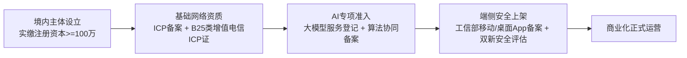
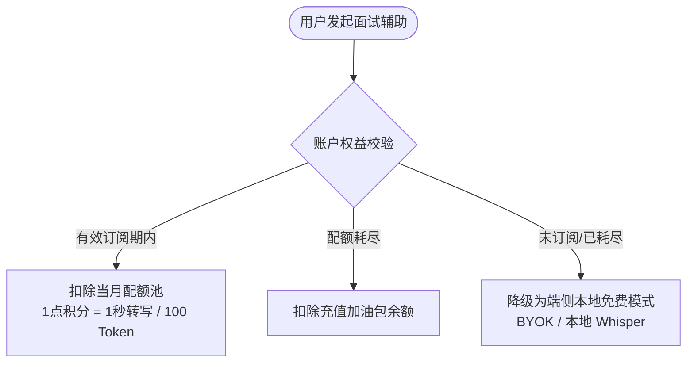
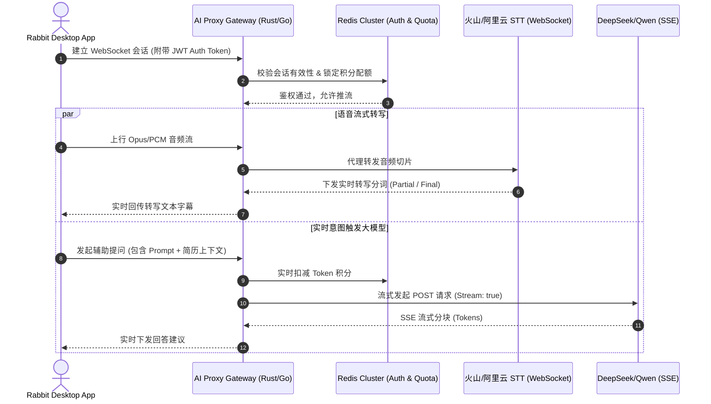
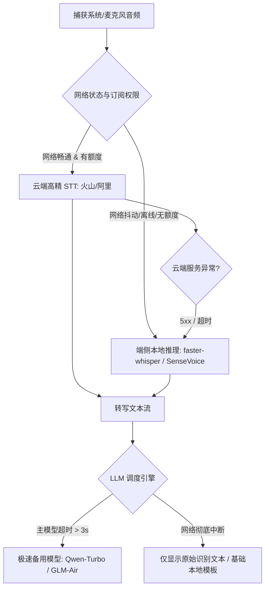
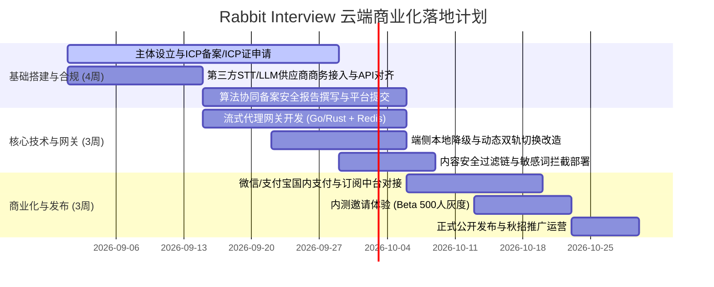

# Rabbit Interview 云端 STT & LLM 商业化订阅产品与技术落地方案

---

## 一、 方案执行摘要与产品定位

### 1.1 背景与核心诉求
Rabbit Interview 是一款专注于面试实时辅助与智能对话增强的应用。前期系统主要依赖本地运行或单机配置，为了提升泛化识别准确率、降低用户终端硬件门槛（尤其是中低配 CPU/GPU 设备），并为**国内用户群体提供开箱即用、低延迟且具备商业可持续性的专业服务**，系统需接入国内主流云端实时语音识别（STT/ASR）与大语言模型（LLM）能力，构建完整的用户鉴权、流式代理网关与会员订阅计费闭环。

### 1.2 核心价值与端云双轨理念
* **云端即开即用**：零门槛获得百亿级声学模型与前沿千亿级大模型能力，中文及中英混杂面试场景识别准确率 $>96\%$。
* **端云协同隐私计算**：支持“纯端侧离线运行（免费/BYOK）”与“云端托管托管服务（订阅制）”双轨并行，兼顾隐私极客与大众付费求职者。
* **极限延迟控制**：全链路采用流式传输与流式推理，端到端首字响应时间（TTFT）控制在 **800ms - 1.2s** 以内，保障面试实时辅助的同步感知。

---

## 二、 云端 STT 与 LLM 供应商选型及成本测算

### 2.1 实时语音转写（STT/ASR）选型对比

国内面试场景对**中英文混杂、专业技术术语、语速突变与口语化停顿**有极高要求。

| 厂商 / 服务 | 计费模式与参考单价 | 中英混杂/技术术语准确率 | 首包延迟 (P95) | 选型建议与特点 |
| :--- | :--- | :--- | :--- | :--- |
| **火山引擎 (豆包 ASR)** | 预付费包 / 阶梯约 **¥1.20 - ¥2.00 / 小时** | ★★★★★ (行业顶尖) | ~200ms | **首选主推**。支持跨 AppID 共享额度，QPS 吞吐稳定，中英混杂及 IT/金融术语识别鲁棒性强。 |
| **阿里智能语音交互 (ISI/Paraformer)** | 后付费阶梯 **¥1.20 - ¥3.50 / 小时**；年包低至 **¥1.00 / 小时** | ★★★★☆ | ~250ms | **核心备用**。成熟度高，支持热词表（可动态注入候选人简历/技能关键词）。 |
| **讯飞实时语音转写 (RTASR)** | 预付费时长包约 **¥2.00 - ¥3.50 / 小时** | ★★★★★ | ~180ms | **专业备选**。识别准确度极高，但并发授权与长连接管理成本偏高。 |
| **智谱 GLM-ASR / 百度文心** | API 按量约 **¥0.06 / 分钟 (折合 ¥3.60 / 小时)** | ★★★★☆ | ~300ms | 适合低频冷启动，直接 API 调用免去复杂流媒体协议维护。 |

---

### 2.2 大语言模型（LLM）选型与成本优化

面试辅助要求模型具备极强的**实时理解、结构化思维与答题提纲生成能力**，同时必须控制推理延迟与 Token 成本。

| 模型 | 定价机制 (输入 / 输出) | 成本优化机制 | 适用场景定位 |
| :--- | :--- | :--- | :--- |
| **DeepSeek-V3 / R1 (官方 API / 硅基流动 / 火山部署)** | 输入：¥1.0 - ¥2.0 / M Token 输出：¥2.0 - ¥8.0 / M Token | **Prompt Caching**：缓存命中输入低至 **¥0.10 / M Token** | **主力生成引擎**。深度思考与面试回答结构化（STAR法则），性价比极高。 |
| **通义千问 Qwen-2.5-Turbo / Plus (阿里百炼)** | 输入：¥0.3 - ¥0.8 / M Token 输出：¥1.2 - ¥2.0 / M Token | **Batch 50% 折扣** + 百炼 Prompt Cache | **高并发与快速摘要**。针对会话意图快速分类、提问意图抽离与复盘纪要生成。 |
| **GLM-4-Air / 9B (智谱 AI)** | 输入：¥1.0 / M Token 输出：¥1.0 / M Token | 极速首字输出（TTFT < 300ms） | **极速快问快答**。实时提示模式下的瞬时灵感触发。 |

---

### 2.3 真实单场面试综合成本测算 (以 1 场 45 分钟深度技术面试为例)
* **STT 成本**：45分钟转写 $\approx 0.75 \text{ 小时} \times ¥1.5 \text{ 元/小时} \approx \mathbf{¥1.125}$
* **LLM 实时提问/回答建议**（约 15-20 次实时触发，包含 System Prompt 简历上下文）：
  * 输入 Token（开启 Prompt Caching）：约 60k Tokens，成本约 $\mathbf{¥0.04}$
  * 输出 Token：约 15k Tokens，成本约 $\mathbf{¥0.08}$
* **单场面试总基建成本**：$\approx \mathbf{¥1.25 \text{ 元 / 场}}$
* **毛利率评估**：若单场按次包定价 ¥9.9 元（或月卡 ¥99 元包 30 场，折合单场基建 ¥37.5 元），基建成本占比仅 **12% ~ 38%**，具备健康的可持续盈利空间。

---

## 三、 国内合规、备案与运营准入规划

面向中国大陆境内用户提供有偿的 AI 面试辅助服务，需遵循《生成式人工智能服务管理暂行办法》《算法推荐管理规定》与电信监管要求。

### 3.1 核心资质清单与申报路径
1. **基础主体与电信资质**：
   * **ICP 备案（免费）**：域名解析至国内服务器，主体实名核验。
   * **B25 类增值电信业务经营许可证（ICP 证）**：有偿订阅计费必须取得。要求内资主体，社保人员及注册资金符合各省通管局标准。
2. **生成式 AI 服务合规（关键路径：避免全量基础模型自备案）**：
   * **“算法备案 + 大模型登记”协同路径**：由于直接调用阿里云、火山引擎、智谱等已获网信办上线批文的模型 API，应用方**无需**进行耗资巨大的基础大模型算法备案，仅需在**全国互联网安全管理服务平台**提交《算法安全自评估报告》，登记所引用的已备案基础大模型编号。
3. **内容安全与审核网关（红线机制）**：
   * **双向安全过滤**：在网关层集成云厂商内容安全 API（如阿里绿网 / 火山文本合规检测），对输入语音转写内容及模型输出进行**政治敏感、违禁违法、欺诈舞弊**关键词秒级拦截与降级提示。
   * **用户协议与免责条款**：显式声明“AI生成内容仅供个人面试复习与技能辅导参考，不得用于非法考试舞弊或侵害第三方权益”。

---

## 四、 商业化订阅与计费定价体系

采用 **“会员周期基础权益包 + 混合消耗积分配额池 + 应急按量加油包”** 模式，有效对冲长尾重度用户的穿底风险。

### 4.1 会员体系与定价梯度

| 会员方案 | 适用人群 | 官方定价 | 权益内容与配额池 |
| :--- | :--- | :--- | :--- |
| **免费体验版 (Free)** | 新用户体验 / 极客 | **¥0** | • 本地端侧 ASR 永久免费（需硬件支持） • 云端体验包：赠送 30 分钟云端 STT + 20 次云端 LLM 回答 |
| **标准月卡 (Pro)** | 正常求职面试期 (1-2个月) | **¥89 / 月** *(连续包月 ¥69)* | • 每月 **15 小时** 云端低延迟 STT（约 20 场面试） • **200 万** 云端 LLM Token（深度推理+STAR答题） • 专属面试简历技能库注入（RAG 增强） |
| **冲刺季卡 (Pro Plus)** | 集中秋招/春招跳槽期 | **¥199 / 季** *(折合 ¥66/月)* | • 每季 **50 小时** 云端 STT + **800 万** LLM Token • 支持面试音视频录音一键生成复盘纪要与改进建议 |
| **按量加油包 (Add-on)** | 会员配额耗尽或临时加钟 | **¥19.9 / 5小时** **¥39.9 / 12小时** | • 永久有效，优先消耗月卡，月卡耗尽自动抵扣 |

### 4.2 计费防刷与风控机制
* **动态时长切片扣费**：STT 会话以 10 秒为最小计费颗粒度，静音 VAD（语音活动检测）超 30 秒自动挂起转写推流，杜绝用户挂机消耗。
* **并发会话限制**：同一账号仅允许 1 路实时音视频辅助流，检测到多地登录瞬时阻断。
* **配额重置与结转**：月度订阅赠送时长在自然周期末清零，加油包购买时长跨期永久保留。

---

## 五、 系统架构：多租户与流式代理鉴权网关

为满足高并发低延迟及跨厂商 API 的统一调度，系统设计**基于无状态 Relay + 有状态 Transceiver 的流式接入网关**。

### 5.1 核心组件设计
1. **边缘流式网关（API Proxy）**：
   * 采用 Go 或 Rust 实现超轻量 WebSocket/HTTP 双向流转发代理。
   * **连接终结与分发**：客户端单长连接复用（音频推流 + 控制指令 + 文本下发），网关侧向云厂商发起连接池化管理，节省客户端 TCP/TLS 握手耗时。
2. **多租户计量与配额中台**：
   * **Redis 预扣预占**：用户开启会话时在 Redis 中预占 30 分钟额度，会话结束通过真实使用上报持久化至 PostgreSQL 并释放多余预占。
   * **统一计费单位（Credits）**：将不同厂商的 STT 分钟数、不同模型的 Input/Output Token 抽象为统一系统积分（Credits），对外解耦底层模型价格波动。
3. **内容敏感词与安全合规过滤链**：
   * 内置 DFA 算法敏感词引擎，并在异步线程向云端合规接口发送文本校验，毫秒级替换违禁敏感词。

---

## 六、 端云协同与多级容灾降级策略

### 6.1 分级降级阶梯

1. **第一级：STT 服务双活故障转移（Active-Active）**
   * 网关监控主用 STT（火山豆包）的 WebSocket 握手状态与首包延迟。若 1.5 秒无响应或触发 5xx 错误，在 200ms 内平滑无缝热切至备用线路（阿里 ISI），用户端无感知。
2. **第二级：端云动态回退（Cloud-to-Edge Fallback）**
   * 当用户端检测到完全脱网、弱网丢包率 $>20\%$ 或云端配额耗尽时，桌面客户端无缝唤醒内置的 `SenseVoice-Small` / `faster-whisper-tiny/base` 本地引擎，确保基础字幕功能不中断。
3. **第三级：大模型推理流式推测与超时保护**
   * 设置 LLM 首次 Token 输出硬超时（800ms）。若深度思考大模型处于排队拥塞状态，自动降级调用低延迟 Mini/Flash 级别模型，优先输出“答题关键词纲要”，杜绝面试官等待时的尴尬空白。

---

## 七、 产品落地里程碑与实施路线图

### 阶段目标与交付物
* **阶段一（第 1-4 周）：合规准入与基建打通**
  * 完成国内域名备案与增值电信业务牌照（ICP证）办理推进；完成大模型算法协同备案登记。
  * 接入火山引擎豆包 ASR、DeepSeek-V3 与阿里云百炼 API。
* **阶段二（第 3-6 周）：网关核心开发与端云集成**
  * 交付高并发流式代理网关，支持用户认证、动态计费、敏感词过滤与双向 WebSocket/SSE 转发。
  * 客户端完成端云双轨与熔断降级架构改造。
* **阶段三（第 6-8 周）：支付接入与商业化上线**
  * 集成国内主流个人/商户支付（微信支付、支付宝），上线会员中心与积分流水明细。
  * 开启 500 人种子用户内测，根据真实会话时长、Token 消耗调优阶梯定价模型后正式全量上线。
