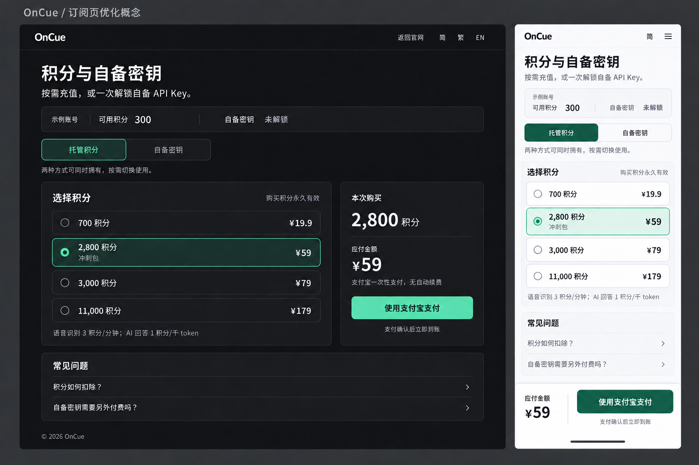

# OnCue 订阅页 UI/UX 优化方案

日期：2026-09-13。范围：landing 的 `/subscribe`，以及首页价格入口到该页的衔接。

**建议采用「用途切换 + 紧凑商品选择 + 单一付款摘要」的购买页结构。** 用户先辨认托管积分与自备密钥的区别，再选择商品，最后核对账号、权益和金额。

设计判断：面向求职用户的购买决策页，保留 OnCue 的石墨灰、翠绿与简洁字体，采用克制、可信的 SaaS 视觉语言。模式为 Redesign - Preserve。

当前页面参数推断约为 `DESIGN_VARIANCE: 3 / MOTION_INTENSITY: 2 / VISUAL_DENSITY: 6`。目标设为 `4 / 3 / 4`：用适度不对称建立主次，减少重复说明，动画只承担操作反馈。

本次交付是方案与生成式视觉概念。已经浏览本地桌面页面、430 × 932 移动模拟视口，并点击核对游客登录入口；已经读取当前源码和本地公开商品接口。登录后的账户状态及支付异常依据源码分析，未执行真实付款，也未验证线上部署。

## 概念预览

图中 300 积分为明确标记的示例账号数据；选中 2,800 积分仅用于展示选中状态。桌面与移动分别展示深、浅主题，实际两种设备均跟随系统主题。功能、文字和品牌图标的实现以本方案与现有资源为准；概念图中的移动菜单图标不构成新增菜单的需求。

## 当前业务与品牌基线

本地 `GET /account/products` 返回 `payments_enabled: true`，商品与当前代码一致：

| 商品 | 价格 | 获得内容 | 有效规则 |
| --- | ---: | --- | --- |
| `CREDITS_700` | ¥19.9 | 700 积分 | 购买积分永久有效 |
| `PASS_WEEK_7D` | ¥59 | 2,800 积分 | 当前同样永久有效 |
| `CREDITS_3000` | ¥79 | 3,000 积分 | 购买积分永久有效 |
| `CREDITS_11000` | ¥179 | 11,000 积分 | 购买积分永久有效 |
| `BYOK_LIFETIME` | ¥39 | 当前账号永久解锁自备 API Key | 不含积分，供应商另行计费 |

目前购买的积分不创建新的月度或季度订阅周期。托管语音与 AI 回答共用积分余额：语音识别 3 积分/分钟，LLM 每 1,000 个计费 token 消耗 1 积分。首次邮箱验证并设置密码后赠送的 300 积分有效期为 30 天。Apple 本地语音只要求登录，不消耗积分，也不要求购买 BYOK。

现有品牌基础：背景 `#0c0c0e`、面板 `#19191d`、正文 `#f4f4f7`、辅助文字 `#9d9da8`，字体为 Inter 加中文系统字体。商品选中状态已有翠绿强调。Tailwind 配置中的 `rounded-xl` 实际是 10px，`rounded-2xl` 实际是 12px，实施时应沿用真实 token。

路由、入口与 SEO 基线：`/subscribe` 由 `App.tsx` 路由至 `AuthPage`；首页 `#pricing` 通过 `?plan=` 预选商品；桌面通过 portal ticket 建立浏览器会话；支付宝返回同一订阅路径。浏览器当前标题为「OnCue 账号」，description 沿用首页介绍。当前未核查搜索排名、收录或 Search Console 数据。方案保留 `/subscribe`、`#pricing`、主导航名称与品牌资产，不调整已有法律文本。

## 问题与处理优先级

| 优先级 | 当前证据 | 对用户的影响 | 方案 |
| --- | --- | --- | --- |
| P0 | 5 个商品在同一网格中，4 次重复托管计费说明 | 需要反复阅读才能发现商品差异，BYOK 与积分容易被当成同类套餐 | 将托管积分与自备密钥分为两种购买用途；公共说明只出现一次 |
| P0 | 游客按钮进入 `/auth/login`；缺少桌面 request 时只显示桌面登录说明 | 按钮看似可以登录，实际还要自行寻找桌面入口 | 在购买页就给出完整桌面登录路径、注册与下载出口 |
| P0 | 「7天冲刺」与底部「购买积分永久有效」同时出现；接口没有商品到期字段 | 容易被理解为积分 7 天后过期 | 展示名建议用「冲刺包」，明确永久有效；保留商品代码和实际计费规则 |
| P0 | 点击卡片只设置 `selectedPlan`；每张卡片按钮仍直接购买自身商品 | 选中标记与最终支付没有形成统一确认关系 | 商品选择使用单选控件，统一付款摘要只读取已选商品 |
| P1 | 订阅页复用带钥匙图标的大登录面板，桌面宽度仅 `max-w-4xl`，内部再嵌多层卡片 | 商品选择空间被容器与装饰占用，页面更像账号表单 | 订阅页采用展开式页面布局，缩小账号信息区，去掉无业务含义的钥匙装饰 |
| P1 | 430px 模拟视口中首屏主要是介绍与第一档商品，BYOK 排在第 5 张 | 手机用户需要较长滚动才能比较购买方式 | 顶部用途切换，积分选项改为紧凑单列，付款区固定在底部 |
| P1 | 加载中同时渲染游客文字和备用商品；网络失败与未登录共享 `context === null` 外观 | 用户可能把网络异常当成退出登录 | 区分加载、游客、账号异常和请求失败，提供对应恢复入口 |
| P1 | 商品 `section` 只有 `onClick`，没有键盘单选语义；页面只有深色主题 | 选中态对键盘和辅助技术不完整，主题适应性不足 | 原生 radio 分组、清晰焦点、系统深浅主题 |

源码还显示：页尾「创建账号」在已登录状态下仍出现。新方案仅在游客引导中保留注册入口；已登录用户看到自己的积分和权限。

## 页面结构与内容

### 顶部与账号信息

- 导航高 64px，沿用现有 logo、OnCue 名称、返回官网与简/繁/EN 切换。
- 标题使用「积分与自备密钥」；副文案使用「按需充值，或一次解锁自备 API Key。」。
- 登录后展示紧凑账号条：当前账号、可用积分、自备密钥状态。邮箱截断时仍需能查看完整值，确保用户知道向哪个账号购买。
- 游客位置替换为登录引导。新用户的「赠送 300 积分，有效期 30 天」与注册入口放在这里，不塞入每个商品。
- 登录后的标题与副文案不再重复要求用户登录。

### 用途选择

采用两项清晰的分类控件：**托管积分 / 自备密钥**。

托管积分说明「无需配置 Key，语音和回答共用积分」；自备密钥说明「¥39 永久解锁，用量由供应商另行计费」。这是商品浏览分类，不修改桌面实际 AI 模式。两种权益可以同时拥有，购买 BYOK 不意味着附赠托管积分。

有合法 `?plan=` 时打开对应分类并选中该商品。直接进入时展示托管积分，保留未选中状态，由用户决定购买金额。无效或已下架的 `plan` 提示重新选择，不静默替换成另一收费商品。

### 商品选择与付款摘要

桌面在 1024px 及以上使用约 7:4 的双列布局，整体宽度上限 1120px，列间距 24-32px。

左侧将四档积分按数量递增排列为四个紧凑选项。每项只保留单选标记、积分数、价格和确有意义的商品名。整行可点，选中后同时出现边框、单选标记与浅色底，颜色不作为唯一信号。

右侧保留一张付款摘要：

- 本次购买：已选积分数或 BYOK 永久解锁。
- 当前购买账号。
- 应付金额：真实商品目录金额。
- 支付说明：「支付宝一次性支付，无自动续费」。
- 唯一支付按钮：「使用支付宝支付」。
- 支付条件：「支付确认后立即到账」。

未选中时显示「请选择商品」，不显示猜测金额。选择商品只更新摘要，不创建订单；只有用户点击支付按钮才下单。创建订单期间锁定选择和支付按钮，保证画面显示的商品与正在提交的订单一致。

自备密钥分类的主体展示永久解锁说明、不含积分、供应商另行计费和支持配置范围，付款摘要展示 ¥39。已解锁时显示明确的「已永久解锁」状态及应用内配置引导，不提供重复购买动作。

### 一处说明与少量问答

积分选项下集中展示扣费规则：「语音识别 3 积分/分钟；AI 回答 1 积分/千 token」。展开说明再解释两者共享余额、token 为计费单位。

常见问题保留 4 项即可：积分如何扣除、购买与赠送积分的有效期、BYOK 是否需要另外付费、Apple 本地语音是否收费。退款和法律约定直接沿用现有正式规则，不新增未经确认的承诺。

不把积分直接承诺为「可面试几场」或「可用多少小时」。真实消耗受语音时长、回答长度和模式选择影响。

## 登录与支付状态

| 状态 | 页面呈现 | 用户可做的事 |
| --- | --- | --- |
| 初次加载 | 账号、选项和摘要的固定尺寸骨架；标注正在读取 | 等待读取；不能误触备用价格下单 |
| 游客 | 可以浏览真实公开商品目录；摘要说明需要从桌面登录 | 「从 OnCue 登录」展开操作指引：打开应用、登录、从设置打开购买页；提供注册和 `/#download` 出口 |
| 已登录、余额为 0 | 显示 0 积分及真实 BYOK 状态 | 正常选择积分；BYOK 已解锁用户仍可按其权益使用供应商 |
| 账号不可用 | 在账号条解释不可购买原因 | 使用已有恢复或支持入口；不能只留一排灰按钮 |
| 支付关闭 | 商品介绍仍可读，摘要注明暂不可支付 | 稍后重试；不展示可点击的支付动作 |
| 正在创建订单 | 原选项与金额保留，按钮显示正在打开支付宝 | 等待，避免重复提交 |
| 支付返回，PENDING | 页面上方突出「正在确认支付」与当前订单；保留现有有界查询机制 | 查询结果；不自动创建新订单 |
| 已确认 PAID，账号正在刷新 | 显示「支付已确认，正在更新积分与权限」 | 等待刷新；刷新失败时重试读取权益，不提示再次付款 |
| 权益已刷新 | 明确说明已确认的商品类别及当前可用余额/解锁状态 | 按说明回到应用使用 |
| CLOSED | 明确「订单已关闭」；显示订单标识 | 重新选择商品后主动下单 |
| 目录或账号网络错误 | 在对应区域显示错误并提供重试 | 重试原操作；区分请求失败与未登录 |
| 查询支付结果失败 | 保留订单状态与标识，说明暂时无法确认 | 重试该订单；不把暂时失败等同于未付款 |

首期复用现有桌面登录和 portal session 流程。当前应用只处理既有认证回调，不能假设已经存在一个可从网页打开购买设置的 deep link。

商品意图优先由 `?plan=` 恢复；需要跨标签页恢复时，只保存非敏感商品代码并在取得目录后校验。清理 `ticket` 或支付回跳参数时保留合法商品意图。不同浏览器无法共享本地选项时明确让用户重新选择，不承诺自动恢复。

## 移动端与视觉规范

| 项目 | 规格 |
| --- | --- |
| 320-767px | 单列、左右 16px；用途切换位于商品之前；四个选项紧凑排列；底部显示已选商品、金额和一个支付按钮 |
| 768-1023px | 保持单列，摘要跟随选择区；按钮和价格不因强行分栏变窄 |
| 1024px 及以上 | 双列选择区与摘要；摘要必要时 sticky，但不遮住导航或焦点目标 |
| 手机底部 | 预留完整操作区高度与 safe area；若极窄屏放不下，金额与按钮上下排列；付款按钮不缩成难读小字 |
| 深色基础 | 保留背景 `#0c0c0e`、面板 `#19191d`、主文 `#f4f4f7`；强调色建议 `#6ee7b7` 配深色按钮文字 |
| 浅色基础 | 建议背景 `#f7f7fa`、面板 `#fcfcfe`、主文 `#17171b`、辅助文字 `#61616e`；强调色 `#176b52` 配浅色按钮文字 |
| 主题策略 | 使用订阅页范围内的语义 CSS 变量，跟随系统；同一页面头部、主体、付款区和页尾保持同一主题 |
| 字体 | 保留 Inter 与中文系统字体；价格采用等宽数字；桌面标题 32-36px，移动 26-28px，正文 15-16px，关键说明至少 14px |
| 形状 | 面板与选项 12px，按钮 10px；语言切换保留现有胶囊形规则 |
| 色彩 | 翠绿承担选中和主操作；红色只用于真实错误；不增加琥珀色促销标签 |
| 动作 | 只对交互反馈使用短暂 opacity/transform 变化；选择即时生效；无持续呼吸、滚动劫持或漂浮装饰 |

该页面以准确交易信息作为主要视觉内容；生成图用于方案评审，线上购买页的主区不需要装饰性照片。实施时使用现有 logo 和已安装的 Lucide 图标，沿用当前 React 与 Tailwind 3 项目基础。

商品单选采用带 `fieldset`/`legend` 的原生 radio 分组，保障分组说明、键盘操作和选中状态。[W3C 表单分组指南](https://www.w3.org/WAI/tutorials/forms/grouping/)

验收采用普通文字至少 4.5:1 对比度、清晰可见的键盘焦点。项目将按钮和关键交互目标定为至少 44px，实际选择行 56-64px；44px 是此方案的易用性目标，WCAG 2.2 AA 的目标尺寸条款为 24 CSS px，并包含例外。[WCAG 2.2](https://www.w3.org/TR/WCAG22/)、[目标尺寸说明](https://www.w3.org/WAI/WCAG22/Understanding/target-size-minimum.html)

## 必须与设计一起明确的两项业务信息

1. **冲刺包名称。** 当前 `PASS_WEEK_7D` 按永久积分发放，「7 天」并不是实际到期规则。首选展示为「冲刺包」，商品代码保持不变。若坚持现名，应紧邻标注「积分永久有效」；不能仅用前端倒计时创造一个后台不存在的期限。
2. **相邻档位的价格关系。** ¥59 的 2,800 积分与 ¥79 的 3,000 积分相比，多 ¥20 只增加 200 积分。前者每千积分约 ¥21.1，后者约 ¥26.3。这是当前价格的直接计算。因此本方案不给 3,000 积分添加「最划算」「推荐」标签；是否调整价格属于另一个产品决定。概念图中的选中态也不是推荐标识。

## 最小实施范围与数据边界

| 位置 | 预计改动 |
| --- | --- |
| [AuthPage.tsx](../../../landing/src/components/AuthPage.tsx) | 仅为 `/subscribe` 调整页面壳、商品选择、摘要、游客引导与状态展示；保留其他认证页面行为 |
| [authContent.ts](../../../landing/src/locales/authContent.ts) | 简体、繁体、英文同步补齐短文案与状态说明 |
| [catalog.ts](../../../landing/src/lib/catalog.ts) | 复用公开目录加载与校验、金额和积分格式化；给商品建立最小展示名映射 |
| [index.css](../../../landing/src/index.css) | 增加范围受控的订阅页主题 token、响应布局与交互反馈 |
| [PricingSection.tsx](../../../landing/src/components/PricingSection.tsx) | 核对入口 `plan` 与实际商品一致；与购买页保持同一商品和价格来源 |
| [verify-account-access.mjs](../../../scripts/verify-account-access.mjs) | 扩展已有验证脚本，覆盖选择与下单一致、游客恢复和支付状态，不引入测试框架 |

当前 API 已提供商品列表、积分总余额、BYOK 权限、付款开关、账号状态、订单状态与订单到期时间。首期据此即可完成主要改善。

当前 API 没有返回「赠送积分剩余数与到期日」「完整订单历史」，也没有在订单返回体中提供全部金额/积分快照。因此以下内容不作为首期界面已有能力：精确赠送余额拆分、个人到期时间轴、历史账单列表、从旧订单重建准确的到账增量。确需增加时先补真实服务端字段，不能根据总余额或现售价格推算。

现有支付验签、幂等键、CSRF、ticket 清理和支付 URL 校验均为保留项。分类选择不改商品代码，布局改造不改变实际发放规则。

## 落地顺序与验收

**P0：让用户选得对、付得清楚。** 先完成商品分类、四档选择、单一付款摘要、7 天名称解释、游客登录引导和支付返回状态。验收以对应账号、选中商品、显示金额和提交商品一致为准。

**P1：完成视觉和设备体验。** 展开订阅页布局、压缩账号条、实现深浅主题和移动底部付款区，补齐三语文案及键盘体验。

检查清单：

- 375、430、768、1024、1440px 下均无横向溢出；桌面主付款动作在常见 900px 高视口首屏内；手机底部付款区不遮内容。
- 云托管与 BYOK 分类从页面前部即可找到；320px 和长英文文案下按钮不换行或裁切。
- 首次加载、游客、零余额、已解锁 BYOK、支付关闭、账号受限和网络错误均有清晰且不同的状态。
- `?plan=CREDITS_3000` 与 `?plan=BYOK_LIFETIME` 正确预选；无效参数不产生静默替换购买；登录/portal 返回后的选项恢复经过验证。
- 创建订单前不发购买请求；点击支付提交已选商品；请求期间无法换成另一个商品而显示旧金额。
- PENDING、PAID、CLOSED、支付查询失败和权益刷新失败有对应提示；查询失败不触发重复购买。
- 键盘可选择商品并付款；焦点清晰；状态由辅助技术获知；焦点不会被底部固定区遮住。
- 两种主题下审查文字、选中态、按钮和错误提示的实际对比度；启用 reduced motion 后无非必要动画。
- 改造后运行 `rtk npm run landing:build`、`rtk npm run build`、`rtk npm run verify:account`、`rtk npm run verify:copilot` 及仓库要求的 Rust 测试；用浏览器完成上述状态验证。
- 对构建产物运行 Lighthouse。LCP < 2.5s、INP < 200ms、CLS < 0.1 为目标，其中真实 INP 应通过交互/现场数据确认，单次 Lighthouse 分数不代表真实用户指标已达标。

以上为后续实施验收项，本次方案没有把概念图当作已完成的页面测试或构建结果。

## 核查依据

- [SubscribePage 与 AuthShell](../../../landing/src/components/AuthPage.tsx)：商品选择与支付位于约 699-880 行；页面壳约 1143-1224 行；无 request 的游客登录分支约 274 行。
- [公开商品目录与格式化](../../../landing/src/lib/catalog.ts)、[中文订阅文案](../../../landing/src/locales/authContent.ts)：当前 5 个商品及积分/BYOK 说明。
- [积分计费规则](../../credit-billing.md)、[支付发放实现](../../../server/src/payments.rs)：当前永久积分、一次性 BYOK 与支付确认后发放规则。
- [浏览器订阅上下文](../../../server/src/oidc.rs)：约 1541 行起提供账号、总余额、商品与权益；[桌面订阅入口](../../../src/lib/hostedAuth.ts) 约 390 行起建立 portal session。
- [Tailwind 品牌配置](../../../landing/tailwind.config.js)、[页面主题](../../../landing/src/index.css)、[HTML 元信息](../../../landing/index.html)。
- 本地运行证据：当前工作区的 4174 Vite 服务、公开商品接口返回、桌面页面截图、430 × 932 Chrome 设备模拟视口以及游客入口点击结果。手机证据为浏览器模拟，非真实手机设备测试。

视觉概念由内置 imagegen 生成；[生成提示词](./concept-prompt.txt) 随方案保存。
