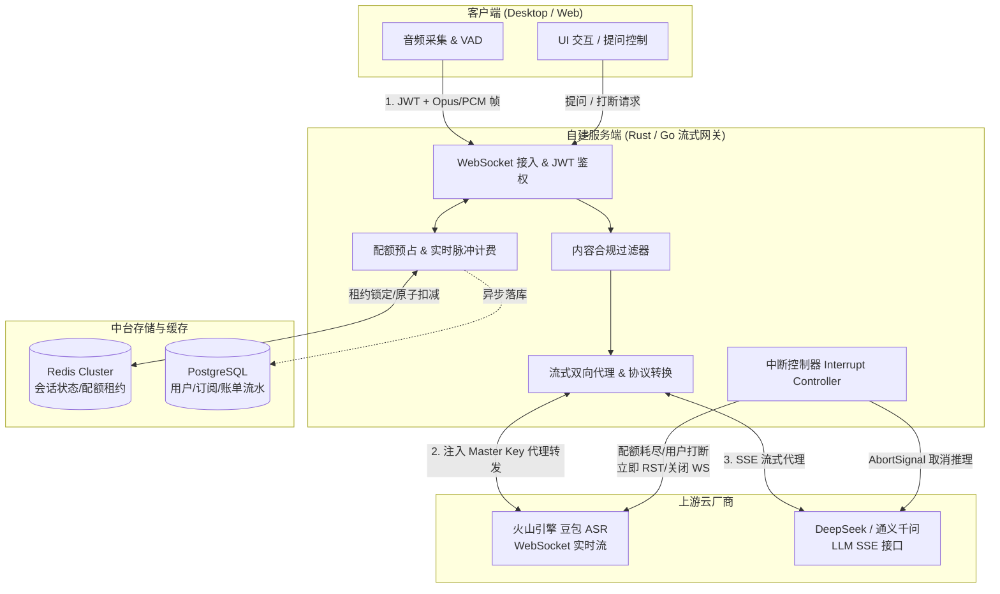
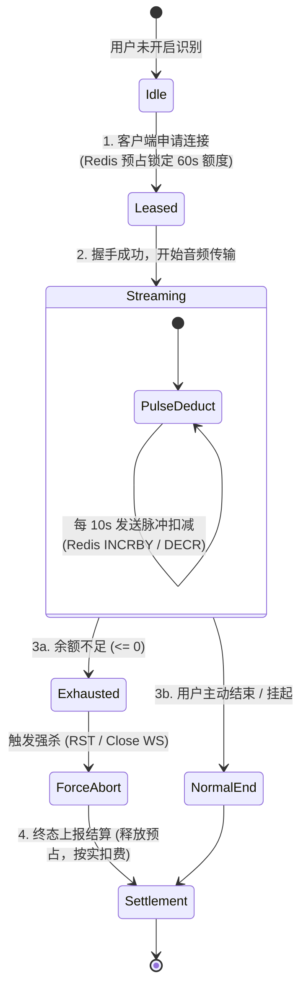

# 火山引擎流式 ASR & LLM 代理网关与订阅计费服务端设计方案

---

## 一、 为什么必须自建服务端进行 API 中转与中断控制？

如果在没有中间服务端的情况下让客户端直接直连火山引擎或大模型，会导致以下致命的商业与技术隐患：
1. **主 API Key 泄露风险**：客户端（无论是 Electron、Tauri、桌面端原生还是 Web 应用）极易被逆向工程反编译或通过代理抓包。一旦火山引擎的 `AppID / AccessToken` 泄露，攻击者可任意盗刷，造成高额云服务账单。
2. **计费与配额不可信**：客户端无法自证明身份与余额，任何本地校验逻辑都会被逆向破解（如篡改剩余时长、绕过订阅检查）。
3. **无法实现真正的“云端主动断流与停机”**：如果用户余额耗尽、订阅到期或发生打断，必须由受信的服务端**主动掐断（Abort / Disconnect）与火山引擎和 LLM 的上游连接**，否则上游厂商仍会按持续连接和生成向您扣费。
4. **国内合规与审计要求**：必须在服务端完成文本内容敏感词过滤、安全日志留存、用户实名鉴权及访问审计。

---

## 二、 服务端全景架构设计



### 2.1 核心服务职责划分

| 模块 | 核心职责 | 技术选型推荐 |
| :--- | :--- | :--- |
| **接入鉴权层** | 终结客户端连接，验证用户 JWT Token，校验有效订阅状态或时长余额。 | Go (`gorilla/websocket` / `gin`) 或 Rust (`actix-web` / `tokio-tungstenite`) |
| **流式代理引擎** | 将客户端音频切片封装为火山引擎协议格式并推流；反向接收识别结果下发给客户端。 | 双向异步 Stream 管道、二进制协议拼包 |
| **实时中断控制器** | 当余额耗尽、客户端主动暂停、或发生切换时，**毫秒级强制断开与火山/LLM的连接**，停止扣费。 | Channel Cancel / Context Cancel / TCP Reset |
| **计费与配额引擎** | “预占租约 + 脉冲扣减 + 终态结算”机制，支持毫秒/秒级计费与防穿底。 | Redis Lua 脚本原子扣减 |
| **合规与内容审计** | 异步或旁路检测文本敏感词，记录审计日志。 | DFA 敏感词库 + 异步合规 API |

---

## 三、 火山引擎实时 ASR 的流式转发与中断实现机制

### 3.1 火山引擎 WebSocket 协议交互特性
火山引擎语音大模型（豆包 ASR）流式协议交互如下：
1. 发送建立连接请求（带鉴权 Header：`Authentication: Bearer; ${VOLC_ACCESS_TOKEN}`）。
2. 发送 `full_client_request`（包含音频格式采样率 `pcm/opus/16000`、识别参数等）。
3. 持续发送 `audio_only_request`（音频二进制块，包含 payload 序列号）。
4. 结束时发送标志包 `flags = 0b0010 (Last packet)`。

### 3.2 服务端双向转发与中断控制器实现逻辑 (Rust / Go 伪代码)

```rust
// 服务端会话处理伪代码 (基于 Tokio 异步运行时)
pub async fn handle_stt_session(
    mut client_ws: WebSocketStream,
    user_id: String,
    redis_pool: Arc<RedisPool>,
    volc_config: Arc<VolcConfig>,
) -> Result<()> {
    // 1. 初始配额预占：检查用户是否有至少 60 秒的配额/积分
    let lease_id = quota_service::acquire_lease(&user_id, 60, &redis_pool).await?;
    if !lease_id.is_valid() {
        client_ws.send(WsMessage::Text(json!({"error": "INSUFFICIENT_BALANCE"}).to_string())).await?;
        return Ok(());
    }

    // 2. 建立到火山引擎的内部 WebSocket 连接 (注入服务端安全保管的 Master Token)
    let (mut volc_ws, _) = connect_to_volcengine(&volc_config).await?;
    volc_ws.send_init_handshake().await?;

    // 3. 建立取消通道（用于主动中断）
    let (interrupt_tx, mut interrupt_rx) = tokio::sync::mpsc::channel::<&str>(1);

    // 4. 启动定时脉冲计费器 (例如每 10 秒扣除一次配额)
    let mut quota_ticker = tokio::time::interval(Duration::from_secs(10));
    let mut total_audio_seconds = 0u64;

    loop {
        tokio::select! {
            // 分支 A: 收到客户端音频帧并转发给火山引擎
            msg = client_ws.next() => {
                match msg {
                    Some(Ok(WsMessage::Binary(audio_chunk))) => {
                        // 封装火山协议二进制帧并发送
                        let volc_frame = package_volc_audio_frame(&audio_chunk);
                        volc_ws.send(volc_frame).await?;
                    }
                    Some(Ok(WsMessage::Text(ctrl))) if ctrl == "PAUSE" || ctrl == "STOP" => {
                        // 客户端主动暂停/停止
                        let _ = interrupt_tx.send("CLIENT_STOP").await;
                    }
                    _ => {
                        // 客户端断开连接
                        let _ = interrupt_tx.send("CLIENT_DISCONNECTED").await;
                    }
                }
            }

            // 分支 B: 收到火山引擎识别结果下发给客户端
            volc_msg = volc_ws.next() => {
                if let Some(Ok(resp)) = volc_msg {
                    let parsed_text = parse_volc_response(&resp)?;
                    client_ws.send(WsMessage::Text(parsed_text)).await?;
                }
            }

            // 分支 C: 10秒周期脉冲扣减与余额校验
            _ = quota_ticker.tick() => {
                total_audio_seconds += 10;
                let remaining = quota_service::deduct_pulse(&user_id, 10, &redis_pool).await?;
                if remaining <= 0 {
                    // 余额不足！触发强制中断
                    let _ = interrupt_tx.send("OUT_OF_CREDITS").await;
                }
            }

            // 分支 D: 核心中断执行器 (API 中断控制器)
            Some(reason) = interrupt_rx.recv() => {
                // a. 向火山引擎发送最后终止包/直接断开 WS 连接，立即停止扣费
                volc_ws.send_finish_packet().await.ok();
                volc_ws.close().await.ok();

                // b. 通知客户端原因
                client_ws.send(WsMessage::Text(json!({
                    "event": "SESSION_TERMINATED",
                    "reason": reason
                }).to_string())).await.ok();
                
                break;
            }
        }
    }

    // 5. 终态清算：释放预占租约，准确记录实际使用秒数至数据库
    quota_service::finalize_settlement(&user_id, lease_id, total_audio_seconds, &redis_pool).await?;
    Ok(())
}
```

---

## 四、 计费与配额控制体系设计（防穿底与防作弊）

采用 **“三段式状态机”** 控制额度生命周期：



### 4.1 关键防护机制

1. **预占租约（Lease Locking）**：
   * 用户发起连接时，检查是否拥有至少 `1 分钟` 的有效额度。在 Redis 中记录一个 2 分钟过期的 `Session Lease`，防止用户多端并发刷时长。
2. **脉冲式流式扣减（10 秒心跳扣费）**：
   * 采用 10 秒为一个计费块（Bucket）。服务端在持续转发流的过程中，每 10 秒调用一次 Redis 原子减法。
   * 一旦扣除后发现用户积分 $\le 0$，触发中断控制器向火山发送 `FIN` 包，断开与火山的连接，并向客户端推送 `OUT_OF_CREDITS` 消息，引导充值。
3. **静音 VAD 防挂机机制（VAD Silence Suspension）**：
   * 客户端或服务端网关内置简易 VAD（语音活性检测）。如果连续 45 秒没有有效人声输入（全为环境底噪或静音），服务端网关自动将上游火山连接**挂起休眠（Suspend）**，停止向火山推流以节省费用，直到检测到新的说话人语音再毫秒级重连。

---

## 五、 大模型（LLM）流式调用的中转与中断打断

在面试辅助场景中，面试官经常打断候选人，或者候选人迅速切换话题，此时之前发起的 LLM 提问需要**即时取消**。

### 5.1 为什么需要服务端中转 LLM？
1. **隐藏模型 API Key**（DeepSeek、通义千问等）。
2. **实时截断推理（AbortController / Stream Reset）**：
   * 当用户在客户端点击“重新回答”或“打断”时，客户端向服务端发送 `CANCEL_REQ {req_id}`。
   * 服务端网关立即调用 HTTP Client 的连接断开（如 Rust 中的 `future::select` 取消，或 Go 中的 `context.CancelFunc()`），底层立即向大模型提供商发送 TCP RST / HTTP2 CANCEL，**模型厂商会立即停止生成未输出的 Token，停止计费**。
3. **Prompt 上下文注入与安全过滤**：在服务端安全组装候选人简历上下文、专业知识库（RAG），防止核心 Prompt 模板泄露。

---

## 六、 服务端数据库表结构设计（PostgreSQL）

支持订阅、积分池、时长包与明细审计的核心表设计：

```sql
-- 1. 用户与会员主表
CREATE TABLE users (
    id UUID PRIMARY KEY DEFAULT gen_random_uuid(),
    phone VARCHAR(20) UNIQUE,
    nickname VARCHAR(50),
    subscription_plan VARCHAR(20) DEFAULT 'FREE', -- FREE, PRO_MONTH, PRO_QUARTER
    plan_expire_at TIMESTAMPTZ,                  -- 会员到期时间
    created_at TIMESTAMPTZ DEFAULT NOW()
);

-- 2. 用户额度钱包表 (时长 + Token 统一积分配额)
CREATE TABLE user_wallets (
    user_id UUID PRIMARY KEY REFERENCES users(id),
    stt_free_seconds_remaining INT DEFAULT 1800,  -- 赠送免费体验秒数 (30分钟)
    stt_monthly_seconds_remaining INT DEFAULT 0,  -- 当月会员配额秒数 (每月清零)
    stt_addon_seconds_remaining INT DEFAULT 0,    -- 永久加油包时长秒数 (不清零)
    llm_tokens_remaining BIGINT DEFAULT 100000,   -- LLM Token 积分
    updated_at TIMESTAMPTZ DEFAULT NOW()
);

-- 3. 实时会话与审计表
CREATE TABLE ai_sessions (
    id UUID PRIMARY KEY DEFAULT gen_random_uuid(),
    user_id UUID NOT NULL REFERENCES users(id),
    session_type VARCHAR(20) NOT NULL,            -- 'STT', 'LLM_CHAT'
    vendor VARCHAR(20) NOT NULL,                  -- 'VOLCENGINE', 'DEEPSEEK'
    started_at TIMESTAMPTZ NOT NULL DEFAULT NOW(),
    ended_at TIMESTAMPTZ,
    duration_seconds INT DEFAULT 0,               -- 真实音频秒数
    tokens_consumed INT DEFAULT 0,                -- 消耗 Token 数
    terminate_reason VARCHAR(30)                  -- 'USER_STOP', 'TIMEOUT', 'OUT_OF_CREDITS'
);

-- 4. 账单与充值流水表
CREATE TABLE billing_ledgers (
    id UUID PRIMARY KEY DEFAULT gen_random_uuid(),
    user_id UUID NOT NULL REFERENCES users(id),
    order_no VARCHAR(64) UNIQUE,
    order_type VARCHAR(20) NOT NULL,              -- 'SUBSCRIPTION', 'ADDON_STT', 'ADDON_TOKEN'
    amount_cents INT NOT NULL,                    -- 金额 (分)
    payment_channel VARCHAR(20) NOT NULL,         -- 'WECHAT_PAY', 'ALIPAY'
    payment_status VARCHAR(20) DEFAULT 'PENDING', -- 'PAID', 'REFUNDED'
    paid_at TIMESTAMPTZ
);
```

---

## 七、 客户端与服务端的通信交互协议定义

客户端与服务端建议通过单个 WebSocket 长连接承载所有控制流与音频流，消息采用 JSON 封装元数据，二进制承载音频：

### 7.1 客户端 -> 服务端 控制指令
```json
// 1. 初始化握手
{
  "action": "START_STT",
  "token": "eyJhbGciOiJIUzI1NiIsIn...",
  "audio_meta": {
    "format": "pcm",
    "sample_rate": 16000,
    "channels": 1
  }
}

// 2. 触发大模型生成回答
{
  "action": "GENERATE_ANSWER",
  "session_id": "9b1deb4d-3b7d-4bad-9bdd-2b0d7b3dcb6d",
  "query": "请结合我的简历介绍一下微服务架构经验",
  "stream": true
}

// 3. 打断大模型生成
{
  "action": "ABORT_LLM",
  "request_id": "req_123456"
}
```

### 7.2 服务端 -> 客户端 响应下发
```json
// 转写文本流 (增量字幕)
{
  "event": "TRANSCRIPT_DELTA",
  "text": "面试官您好，我之前在分布式架构中负责...",
  "is_final": false
}

// 余额预警与强制中断通知
{
  "event": "QUOTA_WARNING",
  "remaining_seconds": 60,
  "msg": "您的云端识别时长仅剩 1 分钟，请及时充值或切换为本地识别"
}
```

---

## 八、 落地实施分步指南

1. **第一阶段：搭建最小可用代理（1 周）**
   * 用 Go/Rust 实现一个轻量 WebSocket 转发服务。
   * 环境变量安全配置火山引擎 `VOLCANO_ACCESS_TOKEN`，打通 `客户端 -> 服务端 -> 火山引擎 -> 客户端` 的回环链路，验证延迟与音频清晰度。
2. **第二阶段：接入 JWT 鉴权与 Redis 脉冲计费（1 周）**
   * 编写 Redis Lua 脚本处理 10 秒脉冲扣减与配额校验。
   * 实现 `interrupt_controller`：当 Redis 返回扣费失败时，主动断开火山 WebSocket 并向客户端返回错误码。
3. **第三阶段：支付接入与订阅管理（1-2 周）**
   * 接入微信支付/支付宝 Native 扫码支付。
   * 提供用户充值会员、购买 5 小时/10 小时加油包的接口与支付回调 Webhook。
4. **第四阶段：端侧平滑容灾降级（3 天）**
   * 在客户端中加入错误拦截：当服务端下发 `OUT_OF_CREDITS` 或网络不可达时，弹窗提示用户并自动无缝回退到客户端内置的本地离线 Whisper / SenseVoice 引擎。
