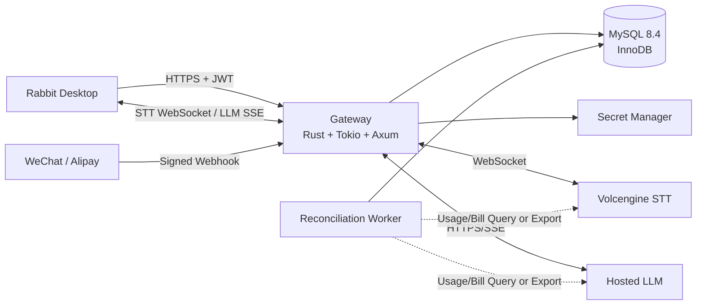
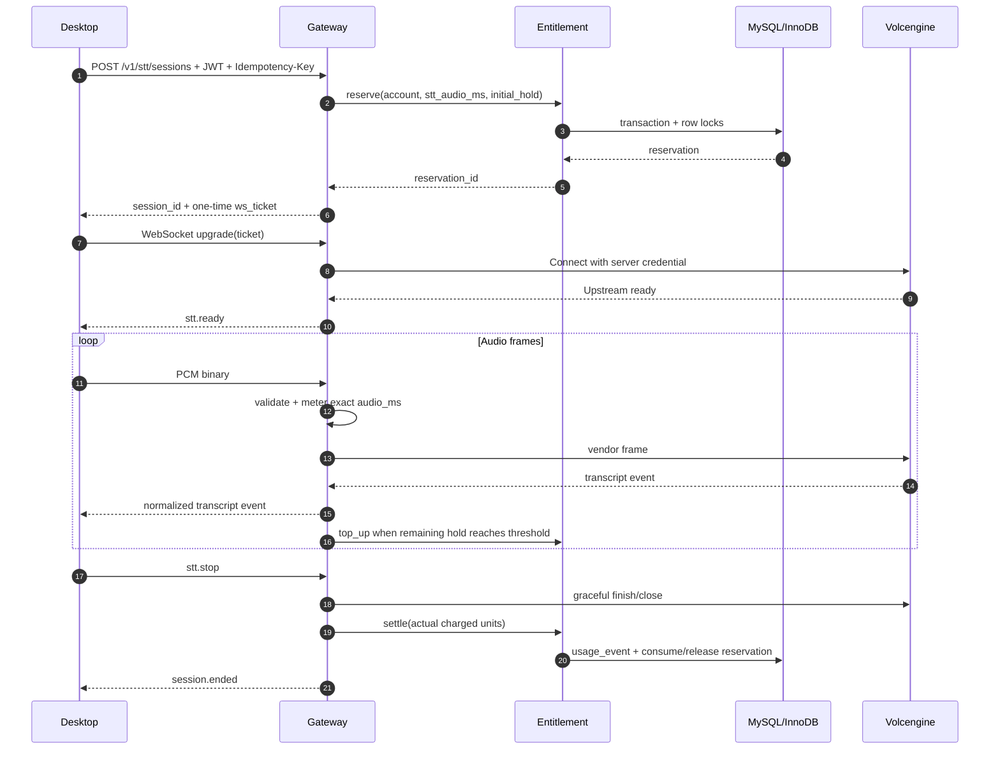
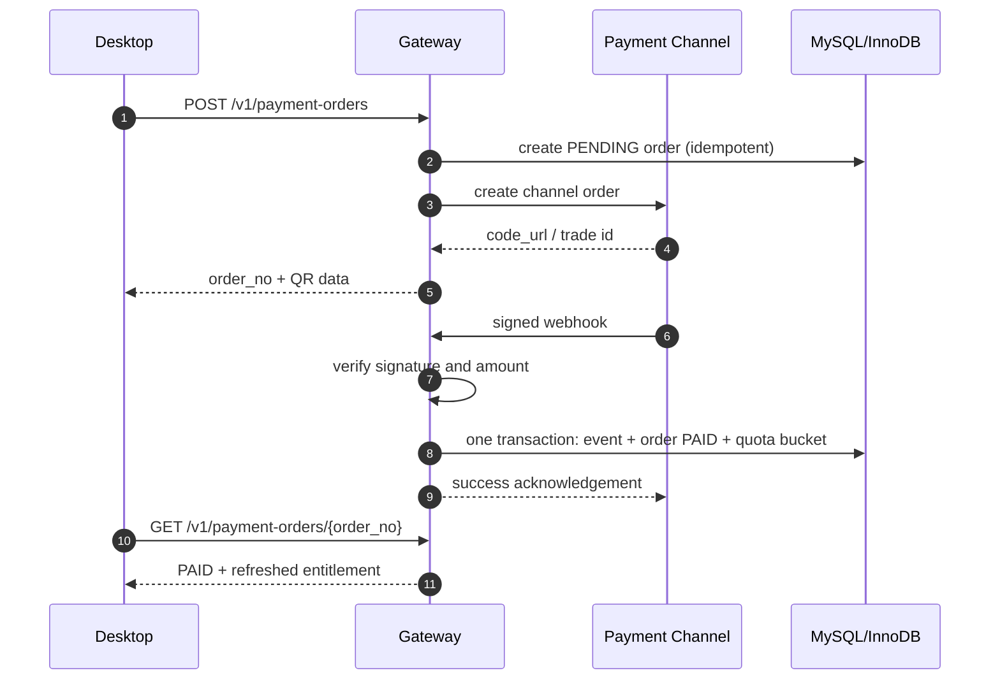

# OnCue 云托管 STT、LLM 网关与订阅计费实施方案

> 状态：Draft / Implementation Plan  
> 目标读者：产品、桌面端、服务端、测试、运维、安全与合规负责人  
> 上游文档：`docs/volcano_gateway_billing_architecture.md`、`docs/cloud_stt_llm_subscription_proposal.md`  
> 更新日期：2026-08-29  
> 实施原则：MySQL 8.4 LTS + InnoDB 单一真相源、先验证厂商契约、保留现有 BYOK/Apple 路径、按阶段灰度

---

## 1. 执行摘要

OnCue 当前是 Tauri 桌面应用：STT 支持 Deepgram、Gemini Live 和 Apple 端侧识别，LLM 由桌面端使用用户自己的密钥直接调用，历史、设置和密钥保存在本地 SQLite；当前付费墙关闭。云托管方案不是简单增加一个模型选项，而是新增账号身份、可信计量、配额账本、厂商代理、支付回调、对账和运维体系。

本方案采用以下最小可行路径：

1. 先用真实火山引擎与 LLM 账号验证协议、计费单位、取消行为和账单结果，未经验证的厂商行为不写成系统承诺。
2. 新建一个 Rust/Tokio 网关，使用 MySQL 8.4 LTS 的 InnoDB 事务作为账号、额度、预占、使用流水和支付状态的唯一真相源。
3. STT 使用“每个音源一条 WebSocket”，保留当前系统音频与麦克风的来源隔离；LLM 使用 HTTP/SSE，并通过稳定的 `request_id` 支持 best-effort 取消。
4. 网关内部记录厂商对齐的原始使用量，再通过带版本的计费策略转换为用户额度；STT 与 LLM 不使用一个模糊的统一积分余额。
5. 桌面端新增 `hosted` 访问模式，同时保留 Deepgram/Gemini BYOK 和 Apple 端侧路径。没有实际实现的 Whisper/SenseVoice 不作为降级承诺。
6. MVP 不引入 Redis Cluster、消息队列、微服务拆分或自动续费。Redis 只在压测证明 MySQL 成为瓶颈后再加入。

实施完成后的核心不变量是：

- 任何并发、重试、断线或进程崩溃都不能让额度变成负数。
- 同一个幂等请求最多产生一次可见业务效果和一次最终扣费。
- 每笔用户扣费都能追溯到一个会话、一个使用事件和一个计费策略版本。
- 每笔充值额度都能追溯到一个已验签、已幂等处理的支付事件。
- 客户端取消表示“停止向用户继续输出并尽力取消上游”，不承诺厂商立即停止计费。
- 网关默认不持久化原始音频、简历、Prompt、转写文本或模型回答。

---

## 2. 范围与非目标

### 2.1 本期范围

- 云托管账号鉴权与短期访问令牌。
- 火山引擎实时 STT 双向流代理。
- 至少一个云托管 LLM 的流式回答代理。
- 服务端权威的 STT 时长与 LLM Token 配额。
- 免费额度、周期额度、加油包三类额度桶。
- 会话预占、增量补充预占、终态结算和异常回收。
- 微信支付或支付宝中的一个渠道先行接入，第二个渠道复用同一支付 Interface。
- 桌面端 hosted/BYOK/Apple 模式共存。
- 使用量、支付和厂商账单的可审计链路。
- 灰度开关、预算熔断、指标和告警。

### 2.2 明确不在 MVP 范围

- Redis Cluster、Kafka、独立计费微服务或跨区域多活。
- 连续包月自动扣款、复杂优惠券、发票、部分退款和渠道分账。
- Whisper、SenseVoice 等尚未存在于仓库中的本地推理能力。
- STT 厂商自动双活切换。先保证单厂商结果正确，再增加第二个生产 Adapter。
- 服务端长期保存面试音频、完整转写、简历或模型回答。
- RAG 知识库和向量数据库。
- 将所有厂商成本折算成对用户公开的单一 Credits 余额。
- 未经法律、安全和产品确认的实名、内容留存或审核策略。

### 2.3 MVP 的刻意简化

- MySQL 8.4 LTS + InnoDB 同时承担持久化、配额行锁和短期预占；达到明确扩容阈值后才增加 Redis。
- 支付先支持一次性购买固定周期权益和加油包，用户手动续期。
- STT v1 只接受 `PCM S16LE / 16kHz / 单声道`，避免服务端为多种音频编码引入转码和时长估算分歧。
- WebSocket v1 不恢复已发送的音频帧；重连创建新的 STT segment，并通过同一个 `interview_id` 归组。

---

## 3. 当前系统基线与差距

### 3.1 当前可复用能力

| 当前能力 | 代码位置 | 云托管实施中的用途 |
|---|---|---|
| STT provider 选择 | `src/lib/settingsStore.ts` | 增加 hosted 模式但保留现有 provider |
| 统一 STT facade | `src/lib/llm.ts` 中 `startDeepgramStream` 等导出 | 在 facade 后增加 Hosted STT Adapter，第一阶段不大规模重命名 |
| 系统音频/麦克风双流 | `src/lib/copilotSession.ts` | 保持每个音源独立会话和 transcript state |
| LLM 流消费与 AbortController | `src/lib/llm.ts`、`src/lib/copilotSession.ts` | Hosted LLM 继续复用流式 UI、取消和不完整回答恢复逻辑 |
| 本地设置、历史与 secrets | `src/lib/db.ts`、`src/lib/keyStore.ts` | 继续服务 BYOK；不承担服务端账号余额 |
| Copilot 验证脚本 | `scripts/verify-copilot.mjs` | 增加 hosted transport 的 mock 回归 |
| Rust/Tokio 运行经验 | `src-tauri/` | 服务端采用相同语言生态，降低维护面 |

### 3.2 必须新增的能力

| 差距 | 当前状态 | 目标状态 |
|---|---|---|
| 用户身份 | 无服务端账号 | 可信 `account_id` 来自已验证令牌 |
| 云托管凭证 | 客户端 BYOK | 厂商密钥只存在于服务端 Secret Manager |
| 配额 | 本地 license 且付费墙关闭 | MySQL 权威额度桶、预占和使用流水 |
| STT 网关 | 客户端直连厂商 | 客户端 → 网关 → 火山引擎 |
| LLM 网关 | 客户端直连厂商 | 客户端 → 网关 → 托管 LLM |
| 支付 | 无 | 创建订单、验签回调、幂等入账、订单查询 |
| 对账 | 无 | 内部 usage 与厂商 usage/账单周期性核对 |
| 运维 | 桌面端日志 | 网关指标、追踪、预算告警和 kill switch |

### 3.3 兼容性要求

- 不删除或改变用户现有 BYOK 密钥。
- 不把 hosted 账号令牌混入现有 LLM/STT 厂商密钥字段。
- hosted 不可用或额度不足时，只回退到用户已配置且可用的路径。
- Apple STT 仍受操作系统与硬件能力约束，不能作为所有平台的统一兜底。
- 当前 `season_pass_license` 在迁移政策确定前只保留原行为；不能同时作为服务端余额依据。

---

## 4. 编码前必须关闭的决策门

以下决策没有书面结论时，不进入生产代码阶段。

| 编号 | 决策 | 必须产出的证据 | 负责人 |
|---|---|---|---|
| D-01 | 火山引擎具体产品、endpoint、鉴权方式、Resource ID | 真实账号完成握手和 5 分钟转写；保存脱敏请求头、响应头和厂商 request ID | 服务端 |
| D-02 | 火山 STT 计费单位、舍入和断线行为 | 10 秒、61 秒、静音、主动停止、进程强杀五组账单对比 | 产品 + 财务 + 服务端 |
| D-03 | LLM 取消后是否仍计费 | 至少三次中途取消，核对 provider usage/控制台账单 | 服务端 + 财务 |
| D-04 | 双音源如何扣用户额度 | 明确按“源音频时长之和”还是“面试墙钟时长”；同时保留原始源时长 | 产品 |
| D-05 | 免费、周期、加油包消耗顺序 | 推荐按最早过期优先、永久包最后；形成产品规则 | 产品 |
| D-06 | 身份来源 | 选定 OIDC/自建手机号登录；明确 access/refresh token 生命周期 | 产品 + 安全 |
| D-07 | 首个支付渠道和商品形态 | 商户资质、回调地址、验签材料、退款边界 | 商务 + 服务端 |
| D-08 | 合规与数据保留 | 音频、转写、简历、Prompt、回答、审计日志逐项确定是否存储和保留期限 | 法务 + 安全 |
| D-09 | 旧 license 迁移 | 不迁移、人工兑换或 grandfather 三选一 | 产品 |

默认建议：D-04 内部永远记录每个音源的原始 `audio_ms`；用户扣费策略可版本化，首版优先采用成本可解释的“源音频时长之和”，并在购买页明确说明。

---

## 5. 目标架构

### 5.1 部署拓扑



MVP 可以让 HTTP 入口、流式会话和后台任务运行在同一个 deployable 中，但实现上保持清晰的 Module seam。只有独立扩容需求出现后才拆进程，不提前拆微服务。

### 5.2 Module 与 Interface

| Module | 外部 Interface | 隐藏在实现内部的职责 |
|---|---|---|
| Identity | `authenticate(token) -> AccountContext` | JWT 校验、issuer/audience、封禁状态、账号映射 |
| Entitlement | `reserve`、`top_up`、`settle`、`release` | 行锁、额度桶排序、预占分配、幂等、异常回收 |
| STT Session | `start`、`ingest_audio`、`stop` | 上游连接、音频计量、背压、转写解析、额度补充、统一清算 |
| LLM Request | `start`、`cancel` | Prompt 组装、最大额度预占、SSE 解析、usage 结算、取消 |
| Payment | `create_order`、`apply_webhook`、`get_order` | 渠道验签、状态机、幂等事件、权益发放 |
| Reconciliation | `reconcile(period)` | 内部 usage 与厂商 usage/账单比对、差异告警 |

不建立独立的 `InterruptController` Module。取消是 STT Session 或 LLM Request 生命周期的一部分，单独抽出只会形成传递调用的浅 Module，并使清算职责分散。

### 5.3 Adapter seam

以下 seam 具有生产 Adapter 和测试 Adapter，因此是真实 seam：

- `SttProvider`：Volcengine Adapter + Fake STT Adapter。
- `LlmProvider`：首个托管 LLM Adapter + Fake LLM Adapter；增加第二厂商时复用同一 Interface。
- `EntitlementStore`：MySQL Adapter + 测试用内存 Adapter；生产逻辑仍必须通过真实 MySQL/InnoDB 集成测试。
- `PaymentProvider`：首个支付渠道 Adapter + Fake Payment Adapter；第二渠道接入后不修改 Payment Module 业务规则。
- `Clock`：系统时钟 + 可控测试时钟，用于额度有效期、租约和回调顺序测试。

Redis 不出现在 Module 外部 Interface。以后增加时，它只能作为 MySQL Adapter 内部的加速实现，不能成为新的余额真相源。

### 5.4 会话所有权

每个 STT WebSocket upgrade 后创建一个受跟踪的会话任务，该任务唯一拥有：

- 客户端 WebSocket 的读写端。
- 火山引擎 WebSocket 的读写端。
- 当前 reservation ID。
- 已接收、已转发和已确认的音频时长计数器。
- 终止原因。
- 会话租约续期任务。

所有正常停止、客户端断开、上游断开、额度耗尽、超时、服务停机和 panic 恢复都汇合到同一个终态清算路径。

Axum 的 WebSocket `on_upgrade` 会把处理逻辑放入独立任务，普通 graceful shutdown 不会自动等待这些任务。因此网关必须显式登记会话任务，在停机时先停止接收新会话、广播取消、等待有限宽限期、再把未完成会话标记为待回收。

---

## 6. 端到端业务流

### 6.1 登录与 WebSocket ticket

浏览器/WebView 的原生 `WebSocket` 构造器不能稳定设置自定义 `Authorization` Header。为了不把长期 JWT 放入 WebSocket URL 或首条业务消息，采用两步流程：

1. 客户端使用 HTTPS 和 `Authorization: Bearer <access_token>` 创建 STT session。
2. 网关鉴权、预占额度并返回一个随机、单次使用、30 秒过期的 `ws_ticket`。
3. 客户端连接 `wss://.../stream?ticket=<opaque_ticket>`。
4. 网关原子消费 ticket；重复使用或过期直接拒绝 upgrade。

ticket 只表示“允许连接到指定 session”，不包含用户余额、厂商密钥或可由客户端修改的授权字段。

### 6.2 STT 正常流程



关键顺序：

- 上游连接只有在初始预占成功后才能创建。
- 网关只有在上游 ready 后才向客户端发送 `stt.ready`。
- 未 ready 前收到的音频最多保留一个有界小缓冲；超限立即报错，不能无限堆积。
- 计量以网关成功验证并接受的 PCM 样本为基础，同时记录实际成功转发量。
- 若厂商账单按另一口径计费，以 D-02 结果确定最终 `charged_units` 策略，但原始计量字段必须保留。

### 6.3 STT 额度耗尽

1. 初始 hold 默认覆盖 60 秒原始音频。
2. 当未消费 hold 低于 15 秒时，Entitlement Module 尝试再预占 60 秒。
3. 补充预占失败后，网关停止接受新的音频帧，向客户端发送 `quota.warning` 和 `session.ending`。
4. 网关发送厂商支持的结束消息并关闭上游；不承诺 TCP RST 等同于立即停止厂商计费。
5. 按已接受/厂商确认的口径结算，释放未消费 hold。
6. 客户端只在存在可用 provider 时显示切换操作，不能虚构“已自动切换到 Whisper”。

60 秒 hold 是风险上限参数，不是对用户的计费颗粒度。上线前可根据真实并发和数据库写入压力调整，但调整必须是服务端配置且留有版本记录。

### 6.4 STT 静音处理

- 客户端 VAD 只用于减少上传和改善体验，不能作为可信扣费依据。
- 网关可基于 PCM 能量做简单静音门控，但原始音频时长、转发音频时长和厂商计费时长必须分开记录。
- v1 不宣称“暂停现有厂商连接后毫秒恢复”。如果 D-02 证明空闲连接仍计费，则连续静音达到阈值后关闭 segment；检测到新语音时创建新 segment。
- 为避免重连丢失首字，客户端保留短时 pre-roll 环形缓冲；具体长度通过真实网络与握手延迟测试确定。

### 6.5 LLM 正常流程

1. 客户端生成稳定的 `request_id`，通过 `POST /v1/llm/answers` 发起请求。
2. 网关根据模型最大输出预算和输入估算预占 LLM 配额。
3. 网关在服务端组装系统 Prompt 和必要上下文，调用托管 LLM。
4. 网关把厂商流标准化为 SSE `answer.delta`。
5. 收到厂商最终 usage 后，记录输入、输出、缓存命中和 reasoning token，再按计费策略结算。
6. 如果厂商没有返回最终 usage，则使用“估算/待对账”状态结算保守额度，并进入 reconciliation 队列。

### 6.6 LLM 取消流程

1. 客户端调用 `DELETE /v1/llm/answers/{request_id}` 或断开 SSE。
2. LLM Request Module 标记请求为 `cancel_requested`，停止向客户端输出并取消本地 HTTP future。
3. 若厂商支持显式 cancel endpoint，则对应 Adapter 调用；否则只关闭当前连接。
4. 等待有限时间获取最终 usage；获取不到则记录 `usage_status = estimated`。
5. 文案只描述为“已停止显示并请求取消”，不得承诺厂商立即停费。

### 6.7 支付与权益发放



支付规则：

- 客户端查询结果不能触发发放权益，只有已验签的服务端回调或服务端主动查单可以。
- 相同渠道事件重复到达必须返回成功且不能重复发放。
- 金额、币种、商户订单号、渠道订单号和商品代码必须全部匹配。
- 订单状态只能按允许的单向状态机推进；迟到的旧事件不能覆盖新状态。
- 支付回调的数据库事务中同时写入 payment event、订单状态和 quota bucket。

---

## 7. 计量、预占与结算设计

### 7.1 原始指标与用户扣费指标

内部必须保留以下原始指标：

| 类型 | 原始指标 | 用户扣费指标 |
|---|---|---|
| STT | `received_audio_ms`、`forwarded_audio_ms`、`provider_audio_ms` | `stt_audio_ms` |
| LLM | input、output、cache-hit、cache-miss、reasoning tokens | `llm_token_units` 或产品确认后的分项单位 |

禁止只保存一个 `duration_seconds` 或 `tokens_consumed` 总数。原始指标用于供应商对账，用户扣费指标用于产品权益，两者通过 `pricing_policy_version` 关联。

### 7.2 额度桶

每次赠送、订阅续期、加油包购买或人工调整都创建独立 quota bucket：

- `FREE_TRIAL`：可设置一次性有效期。
- `SUBSCRIPTION`：有效期与订阅周期一致，不执行月底批量清零。
- `ADDON`：默认无失效时间。
- `ADJUSTMENT`：客服补偿或纠错，必须有操作人和原因。

消费顺序默认按：

1. 已生效且最早到期的 bucket。
2. 相同到期时间按显式 priority。
3. 无到期时间的永久 bucket 最后。

### 7.3 预占算法

`reserve(account_id, metric, units, idempotency_key)` 在一个 MySQL/InnoDB 事务中：

1. `SELECT id FROM accounts WHERE id = ? FOR UPDATE`，先锁定账号钱包行。
2. 查询该账号所有已生效、未过期且余额大于 0 的 bucket，按 `(valid_until IS NULL)、valid_until、priority、id` 的确定性顺序 `FOR UPDATE`。
3. 检查总余额是否满足请求；不足时回滚，不修改任何行。
4. 从一个或多个 bucket 的 `remaining_units` 中扣除 hold。
5. 创建 reservation、带顺序的 allocation 明细和幂等结果。
6. 提交事务并返回 reservation。

这意味着已预占单位立即从可用余额中移除，从根源上阻止多设备并发穿底。

所有会改变账号余额的事务，包括 reserve、top-up、settle、release、支付发放和人工 adjustment，都必须先锁定同一账号行，再锁 bucket/reservation；禁止反向加锁。MySQL 返回死锁错误 `1213` 或锁等待超时 `1205` 时，只允许对具备幂等键的**整个事务**做最多 3 次带抖动重试，不能从失败 SQL 的中间位置继续。

> ponytail: 首版用账号行锁串行化单账号的钱包变更；只有监控证明单账号锁竞争成为瓶颈时，才按 metric 拆分锁粒度。

### 7.4 补充预占

`top_up(reservation_id, units, idempotency_key)` 与首次预占使用同一规则。每次 top-up 都有独立幂等键，例如：

```text
stt:{session_id}:hold:0
stt:{session_id}:hold:1
stt:{session_id}:hold:2
```

网络重试可以重复提交同一个键，但不能生成第二次扣减。

### 7.5 终态结算

`settle(reservation_id, actual_units, usage_event_key)` 在一个事务中：

1. 锁定 reservation；若已 settled/released，返回之前结果。
2. 按 allocation 顺序把 `actual_units` 分配为 consumed。
3. 将未消费 hold 加回对应 bucket。
4. 写入不可变 usage event。
5. 把 reservation 标记为 settled。
6. 把 session 标记为 ended，并保存 terminate reason。

如果实际使用量超过 hold，先尝试在同一事务补足差额；无法补足时记录 reconciliation error 并触发告警。正常路径应通过提前 top-up 避免该情况。

### 7.6 崩溃回收

- 活跃 session 和 reservation 都有 `lease_expires_at`。
- 会话任务周期性续租，但续租不代表扣费。
- 后台任务只回收“租约过期且 reservation 仍 active”的记录。
- 回收时关闭状态、释放未消费 hold，并写入 `ABANDONED` 终止原因。
- 如果之后收到迟到的 settle，请求因 reservation 非 active 而不能再次修改余额，只记录人工对账项。

### 7.7 幂等保证

系统不依赖“消息只到一次”。所有外部写请求都按至少一次到达设计，并通过数据库唯一约束实现业务效果一次：

- 创建会话：`(account_id, client_request_id)` 唯一。
- top-up：`idempotency_key` 唯一。
- usage：`(session_id, event_key)` 唯一。
- 支付回调：`(channel, channel_event_id)` 唯一。
- 权益发放：`(source_type, source_ref, metric)` 唯一。

---

## 8. MySQL 8.4 数据模型

以下 DDL 是实施基线，不是直接复制到生产的最终 migration；字段名可以随代码风格微调，但约束、外键和幂等关系不得删除。生产基线固定为 MySQL 8.4 LTS、InnoDB、`utf8mb4` 和 UTC：

- UUID 由 Rust 服务生成，首版用 ASCII `CHAR(36)` 保存；不依赖数据库 UUID 默认函数。只有容量数据证明索引体积成为瓶颈时，再评估 `BINARY(16)`。
- 时间点统一使用 `DATETIME(6)` 并按 UTC 读写；API 边界继续使用 RFC 3339 UTC。
- JSON 文档使用原生 `JSON`；布尔值使用 `TINYINT(1)` 并加约束；账本中的状态码和外部标识采用 binary collation，避免大小写不同的值被唯一键误判为相同。
- MySQL 不支持带 `WHERE` 谓词的 partial index。首版使用普通复合索引和账号行锁，以 `EXPLAIN` 与真实压测决定是否增加生成列索引。
- 连接初始化必须固定严格 SQL mode、UTC 时区和事务隔离级别；建议账本连接使用 `READ COMMITTED` 缩小无关 gap lock，CI、预发布和生产必须一致。

```sql
CREATE TABLE accounts (
    id CHAR(36) CHARACTER SET ascii COLLATE ascii_bin NOT NULL,
    external_subject VARCHAR(255) NOT NULL,
    status VARCHAR(16) NOT NULL DEFAULT 'ACTIVE',
    created_at DATETIME(6) NOT NULL DEFAULT CURRENT_TIMESTAMP(6),
    updated_at DATETIME(6) NOT NULL DEFAULT CURRENT_TIMESTAMP(6)
        ON UPDATE CURRENT_TIMESTAMP(6),
    PRIMARY KEY (id),
    UNIQUE KEY accounts_external_subject_uq (external_subject),
    CONSTRAINT accounts_status_ck
        CHECK (status IN ('ACTIVE', 'SUSPENDED', 'CLOSED'))
) ENGINE=InnoDB DEFAULT CHARSET=utf8mb4 COLLATE=utf8mb4_bin;

CREATE TABLE subscriptions (
    id CHAR(36) CHARACTER SET ascii COLLATE ascii_bin NOT NULL,
    account_id CHAR(36) CHARACTER SET ascii COLLATE ascii_bin NOT NULL,
    plan_code VARCHAR(64) NOT NULL,
    status VARCHAR(16) NOT NULL,
    payment_channel VARCHAR(32),
    provider_subscription_id VARCHAR(191),
    current_period_start DATETIME(6) NOT NULL,
    current_period_end DATETIME(6) NOT NULL,
    created_at DATETIME(6) NOT NULL DEFAULT CURRENT_TIMESTAMP(6),
    updated_at DATETIME(6) NOT NULL DEFAULT CURRENT_TIMESTAMP(6)
        ON UPDATE CURRENT_TIMESTAMP(6),
    PRIMARY KEY (id),
    UNIQUE KEY subscriptions_provider_uq
        (payment_channel, provider_subscription_id),
    KEY subscriptions_account_period_idx
        (account_id, current_period_end),
    CONSTRAINT subscriptions_account_fk
        FOREIGN KEY (account_id) REFERENCES accounts (id),
    CONSTRAINT subscriptions_status_ck
        CHECK (status IN ('PENDING', 'ACTIVE', 'EXPIRED', 'CANCELED', 'REFUNDED')),
    CONSTRAINT subscriptions_period_ck
        CHECK (current_period_end > current_period_start)
) ENGINE=InnoDB DEFAULT CHARSET=utf8mb4 COLLATE=utf8mb4_bin;

CREATE TABLE quota_buckets (
    id CHAR(36) CHARACTER SET ascii COLLATE ascii_bin NOT NULL,
    account_id CHAR(36) CHARACTER SET ascii COLLATE ascii_bin NOT NULL,
    metric VARCHAR(32) NOT NULL,
    source_type VARCHAR(32) NOT NULL,
    source_ref VARCHAR(191) NOT NULL,
    granted_units BIGINT NOT NULL,
    remaining_units BIGINT NOT NULL,
    valid_from DATETIME(6) NOT NULL DEFAULT CURRENT_TIMESTAMP(6),
    valid_until DATETIME(6),
    priority SMALLINT NOT NULL DEFAULT 100,
    created_at DATETIME(6) NOT NULL DEFAULT CURRENT_TIMESTAMP(6),
    PRIMARY KEY (id),
    UNIQUE KEY quota_buckets_grant_uq
        (account_id, metric, source_type, source_ref),
    KEY quota_buckets_wallet_idx
        (account_id, metric, valid_until, priority, id),
    CONSTRAINT quota_buckets_account_fk
        FOREIGN KEY (account_id) REFERENCES accounts (id),
    CONSTRAINT quota_buckets_metric_ck
        CHECK (metric IN ('STT_AUDIO_MS', 'LLM_TOKEN_UNITS')),
    CONSTRAINT quota_buckets_source_type_ck
        CHECK (source_type IN ('FREE_TRIAL', 'SUBSCRIPTION', 'ADDON', 'ADJUSTMENT')),
    CONSTRAINT quota_buckets_granted_ck CHECK (granted_units > 0),
    CONSTRAINT quota_buckets_remaining_ck
        CHECK (remaining_units >= 0 AND remaining_units <= granted_units),
    CONSTRAINT quota_buckets_validity_ck
        CHECK (valid_until IS NULL OR valid_until > valid_from)
) ENGINE=InnoDB DEFAULT CHARSET=utf8mb4 COLLATE=utf8mb4_bin;

CREATE TABLE ai_sessions (
    id CHAR(36) CHARACTER SET ascii COLLATE ascii_bin NOT NULL,
    account_id CHAR(36) CHARACTER SET ascii COLLATE ascii_bin NOT NULL,
    client_request_id VARCHAR(128) CHARACTER SET ascii COLLATE ascii_bin NOT NULL,
    interview_id CHAR(36) CHARACTER SET ascii COLLATE ascii_bin,
    kind VARCHAR(16) NOT NULL,
    audio_source VARCHAR(16),
    provider VARCHAR(64) NOT NULL,
    model VARCHAR(128) NOT NULL,
    state VARCHAR(16) NOT NULL,
    provider_request_id VARCHAR(191),
    terminate_reason VARCHAR(64),
    pricing_policy_version VARCHAR(64) NOT NULL,
    lease_expires_at DATETIME(6),
    started_at DATETIME(6),
    ended_at DATETIME(6),
    created_at DATETIME(6) NOT NULL DEFAULT CURRENT_TIMESTAMP(6),
    updated_at DATETIME(6) NOT NULL DEFAULT CURRENT_TIMESTAMP(6)
        ON UPDATE CURRENT_TIMESTAMP(6),
    PRIMARY KEY (id),
    UNIQUE KEY ai_sessions_client_request_uq
        (account_id, client_request_id),
    KEY ai_sessions_lease_idx (state, lease_expires_at),
    KEY ai_sessions_provider_request_idx
        (provider, provider_request_id),
    CONSTRAINT ai_sessions_account_fk
        FOREIGN KEY (account_id) REFERENCES accounts (id),
    CONSTRAINT ai_sessions_kind_ck CHECK (kind IN ('STT', 'LLM')),
    CONSTRAINT ai_sessions_audio_source_ck
        CHECK (audio_source IS NULL OR audio_source IN ('SYSTEM', 'MICROPHONE')),
    CONSTRAINT ai_sessions_state_ck
        CHECK (state IN ('RESERVED', 'CONNECTING', 'ACTIVE', 'ENDING', 'ENDED', 'FAILED', 'ABANDONED'))
) ENGINE=InnoDB DEFAULT CHARSET=utf8mb4 COLLATE=utf8mb4_bin;

CREATE TABLE quota_reservations (
    id CHAR(36) CHARACTER SET ascii COLLATE ascii_bin NOT NULL,
    account_id CHAR(36) CHARACTER SET ascii COLLATE ascii_bin NOT NULL,
    session_id CHAR(36) CHARACTER SET ascii COLLATE ascii_bin NOT NULL,
    metric VARCHAR(32) NOT NULL,
    held_units BIGINT NOT NULL,
    settled_units BIGINT NOT NULL DEFAULT 0,
    state VARCHAR(16) NOT NULL DEFAULT 'ACTIVE',
    expires_at DATETIME(6) NOT NULL,
    created_at DATETIME(6) NOT NULL DEFAULT CURRENT_TIMESTAMP(6),
    updated_at DATETIME(6) NOT NULL DEFAULT CURRENT_TIMESTAMP(6)
        ON UPDATE CURRENT_TIMESTAMP(6),
    PRIMARY KEY (id),
    UNIQUE KEY quota_reservations_session_metric_uq (session_id, metric),
    KEY quota_reservations_reaper_idx (state, expires_at),
    CONSTRAINT quota_reservations_account_fk
        FOREIGN KEY (account_id) REFERENCES accounts (id),
    CONSTRAINT quota_reservations_session_fk
        FOREIGN KEY (session_id) REFERENCES ai_sessions (id),
    CONSTRAINT quota_reservations_metric_ck
        CHECK (metric IN ('STT_AUDIO_MS', 'LLM_TOKEN_UNITS')),
    CONSTRAINT quota_reservations_held_ck CHECK (held_units > 0),
    CONSTRAINT quota_reservations_settled_ck
        CHECK (settled_units >= 0 AND settled_units <= held_units),
    CONSTRAINT quota_reservations_state_ck
        CHECK (state IN ('ACTIVE', 'SETTLED', 'RELEASED', 'EXPIRED'))
) ENGINE=InnoDB DEFAULT CHARSET=utf8mb4 COLLATE=utf8mb4_bin;

CREATE TABLE quota_reservation_allocations (
    reservation_id CHAR(36) CHARACTER SET ascii COLLATE ascii_bin NOT NULL,
    bucket_id CHAR(36) CHARACTER SET ascii COLLATE ascii_bin NOT NULL,
    allocation_order SMALLINT UNSIGNED NOT NULL,
    reserved_units BIGINT NOT NULL,
    consumed_units BIGINT NOT NULL DEFAULT 0,
    PRIMARY KEY (reservation_id, bucket_id),
    UNIQUE KEY quota_reservation_allocations_order_uq
        (reservation_id, allocation_order),
    CONSTRAINT quota_reservation_allocations_reservation_fk
        FOREIGN KEY (reservation_id) REFERENCES quota_reservations (id),
    CONSTRAINT quota_reservation_allocations_bucket_fk
        FOREIGN KEY (bucket_id) REFERENCES quota_buckets (id),
    CONSTRAINT quota_reservation_allocations_reserved_ck
        CHECK (reserved_units > 0),
    CONSTRAINT quota_reservation_allocations_consumed_ck
        CHECK (consumed_units >= 0 AND consumed_units <= reserved_units)
) ENGINE=InnoDB DEFAULT CHARSET=utf8mb4 COLLATE=utf8mb4_bin;

CREATE TABLE idempotency_records (
    account_id CHAR(36) CHARACTER SET ascii COLLATE ascii_bin NOT NULL,
    idempotency_key VARCHAR(191) CHARACTER SET ascii COLLATE ascii_bin NOT NULL,
    operation VARCHAR(64) NOT NULL,
    request_hash CHAR(64) CHARACTER SET ascii COLLATE ascii_bin NOT NULL,
    response_json JSON NOT NULL,
    created_at DATETIME(6) NOT NULL DEFAULT CURRENT_TIMESTAMP(6),
    expires_at DATETIME(6) NOT NULL,
    PRIMARY KEY (account_id, idempotency_key),
    KEY idempotency_records_expiry_idx (expires_at),
    CONSTRAINT idempotency_records_account_fk
        FOREIGN KEY (account_id) REFERENCES accounts (id)
) ENGINE=InnoDB DEFAULT CHARSET=utf8mb4 COLLATE=utf8mb4_bin;

CREATE TABLE usage_events (
    id CHAR(36) CHARACTER SET ascii COLLATE ascii_bin NOT NULL,
    account_id CHAR(36) CHARACTER SET ascii COLLATE ascii_bin NOT NULL,
    session_id CHAR(36) CHARACTER SET ascii COLLATE ascii_bin NOT NULL,
    event_key VARCHAR(128) CHARACTER SET ascii COLLATE ascii_bin NOT NULL,
    usage_status VARCHAR(16) NOT NULL,
    received_audio_ms BIGINT NOT NULL DEFAULT 0,
    forwarded_audio_ms BIGINT NOT NULL DEFAULT 0,
    provider_audio_ms BIGINT,
    input_tokens BIGINT NOT NULL DEFAULT 0,
    output_tokens BIGINT NOT NULL DEFAULT 0,
    cache_hit_tokens BIGINT NOT NULL DEFAULT 0,
    reasoning_tokens BIGINT NOT NULL DEFAULT 0,
    charged_metric VARCHAR(32) NOT NULL,
    charged_units BIGINT NOT NULL,
    pricing_policy_version VARCHAR(64) NOT NULL,
    provider_cost_micros BIGINT,
    currency CHAR(3),
    occurred_at DATETIME(6) NOT NULL,
    created_at DATETIME(6) NOT NULL DEFAULT CURRENT_TIMESTAMP(6),
    PRIMARY KEY (id),
    UNIQUE KEY usage_events_session_event_uq (session_id, event_key),
    KEY usage_events_account_time_idx (account_id, occurred_at),
    CONSTRAINT usage_events_account_fk
        FOREIGN KEY (account_id) REFERENCES accounts (id),
    CONSTRAINT usage_events_session_fk
        FOREIGN KEY (session_id) REFERENCES ai_sessions (id),
    CONSTRAINT usage_events_status_ck
        CHECK (usage_status IN ('FINAL', 'ESTIMATED', 'RECONCILED', 'DISPUTED')),
    CONSTRAINT usage_events_nonnegative_ck
        CHECK (
            received_audio_ms >= 0
            AND forwarded_audio_ms >= 0
            AND (provider_audio_ms IS NULL OR provider_audio_ms >= 0)
            AND input_tokens >= 0
            AND output_tokens >= 0
            AND cache_hit_tokens >= 0
            AND reasoning_tokens >= 0
            AND charged_units >= 0
            AND (provider_cost_micros IS NULL OR provider_cost_micros >= 0)
        ),
    CONSTRAINT usage_events_metric_ck
        CHECK (charged_metric IN ('STT_AUDIO_MS', 'LLM_TOKEN_UNITS'))
) ENGINE=InnoDB DEFAULT CHARSET=utf8mb4 COLLATE=utf8mb4_bin;

CREATE TABLE payment_orders (
    id CHAR(36) CHARACTER SET ascii COLLATE ascii_bin NOT NULL,
    account_id CHAR(36) CHARACTER SET ascii COLLATE ascii_bin NOT NULL,
    merchant_order_no VARCHAR(64) CHARACTER SET ascii COLLATE ascii_bin NOT NULL,
    product_code VARCHAR(64) NOT NULL,
    channel VARCHAR(16) NOT NULL,
    channel_trade_no VARCHAR(128) CHARACTER SET ascii COLLATE ascii_bin,
    amount_minor BIGINT NOT NULL,
    currency CHAR(3) CHARACTER SET ascii COLLATE ascii_bin NOT NULL DEFAULT 'CNY',
    status VARCHAR(16) NOT NULL DEFAULT 'PENDING',
    paid_at DATETIME(6),
    created_at DATETIME(6) NOT NULL DEFAULT CURRENT_TIMESTAMP(6),
    updated_at DATETIME(6) NOT NULL DEFAULT CURRENT_TIMESTAMP(6)
        ON UPDATE CURRENT_TIMESTAMP(6),
    PRIMARY KEY (id),
    UNIQUE KEY payment_orders_merchant_order_uq (merchant_order_no),
    UNIQUE KEY payment_orders_channel_trade_uq (channel_trade_no),
    KEY payment_orders_account_time_idx (account_id, created_at),
    CONSTRAINT payment_orders_account_fk
        FOREIGN KEY (account_id) REFERENCES accounts (id),
    CONSTRAINT payment_orders_channel_ck
        CHECK (channel IN ('WECHAT_PAY', 'ALIPAY')),
    CONSTRAINT payment_orders_amount_ck CHECK (amount_minor > 0),
    CONSTRAINT payment_orders_currency_ck CHECK (currency = 'CNY'),
    CONSTRAINT payment_orders_status_ck
        CHECK (status IN ('PENDING', 'PAID', 'CLOSED', 'REFUNDED', 'FAILED'))
) ENGINE=InnoDB DEFAULT CHARSET=utf8mb4 COLLATE=utf8mb4_bin;

CREATE TABLE payment_events (
    id CHAR(36) CHARACTER SET ascii COLLATE ascii_bin NOT NULL,
    order_id CHAR(36) CHARACTER SET ascii COLLATE ascii_bin,
    channel VARCHAR(16) NOT NULL,
    channel_event_id VARCHAR(191) CHARACTER SET ascii COLLATE ascii_bin NOT NULL,
    event_type VARCHAR(64) NOT NULL,
    payload_hash CHAR(64) CHARACTER SET ascii COLLATE ascii_bin NOT NULL,
    signature_valid TINYINT(1) NOT NULL,
    normalized_payload JSON NOT NULL,
    processing_error TEXT,
    received_at DATETIME(6) NOT NULL DEFAULT CURRENT_TIMESTAMP(6),
    processed_at DATETIME(6),
    PRIMARY KEY (id),
    UNIQUE KEY payment_events_channel_event_uq (channel, channel_event_id),
    KEY payment_events_processing_idx (processed_at, received_at),
    CONSTRAINT payment_events_order_fk
        FOREIGN KEY (order_id) REFERENCES payment_orders (id),
    CONSTRAINT payment_events_channel_ck
        CHECK (channel IN ('WECHAT_PAY', 'ALIPAY')),
    CONSTRAINT payment_events_signature_ck
        CHECK (signature_valid IN (0, 1))
) ENGINE=InnoDB DEFAULT CHARSET=utf8mb4 COLLATE=utf8mb4_bin;
```

### 8.1 migration 纪律

- migration 文件只前进，不在已发布环境修改旧 migration。
- 所有 schema 变更先在空数据库和上一生产版本快照上各跑一次。
- 使用 SQLx migration 管理服务端 MySQL 8.4；本地 Tauri SQLite 保持现有路径，二者不得混用。
- CI 对 SQLx 查询做离线元数据检查，生产镜像构建不依赖在线数据库。
- migration 和集成测试使用与生产相同的 MySQL 8.4 小版本、SQL mode、UTC 时区和事务隔离级别。
- Runtime SQL 使用 MySQL 的 `?` bind 参数；只有命中预期幂等唯一键的 `1062` 才能回读记录并核对 `request_hash`，其他唯一键冲突按错误处理；`1213`/`1205` 仅在幂等事务边界有界重试。
- 所有主键 UUID 在进入事务前由应用生成，重试时复用相同 ID 和幂等键。
- 余额修正只能通过新的 adjustment bucket/usage event，不直接手工改历史流水。

---

## 9. 客户端与网关协议 v1

### 9.1 通用规则

- HTTPS/WSS only。
- 所有创建类请求携带 `Idempotency-Key`。
- 所有 JSON 使用有效 JSON，不包含注释。
- 时间使用 RFC 3339 UTC。
- 数量字段使用整数，时长统一毫秒，金额统一最小货币单位。
- 错误体统一包含 `code`、`message`、`request_id`、`retryable`。
- 客户端不能提交 `account_id`、余额、价格、厂商密钥或最终 usage。

### 9.2 创建 STT session

```http
POST /v1/stt/sessions
Authorization: Bearer <access_token>
Idempotency-Key: <uuid>
Content-Type: application/json
```

```json
{
  "client_request_id": "c4cf0a86-c0ec-41ba-b478-1a984961e547",
  "interview_id": "74cb9bd0-c2cc-4102-9381-1e93c66b6a30",
  "source": "system",
  "language": "zh-CN",
  "audio": {
    "encoding": "pcm_s16le",
    "sample_rate": 16000,
    "channels": 1
  }
}
```

```json
{
  "session_id": "a8d9b2cb-144b-47f7-a4aa-a9afb8485557",
  "protocol_version": 1,
  "ws_url": "wss://gateway.example.com/v1/stt/sessions/a8d9b2cb-144b-47f7-a4aa-a9afb8485557/stream",
  "ws_ticket": "opaque-single-use-ticket",
  "ticket_expires_at": "2026-08-28T12:00:30Z",
  "reserved_ms": 60000
}
```

相同 Idempotency-Key 和相同请求体返回同一个结果；相同 key 配不同请求体返回 `409 IDEMPOTENCY_CONFLICT`。

### 9.3 STT WebSocket 客户端消息

音频帧直接使用 binary PCM；每条连接已经绑定 session 与 source，不在每个帧重复 JSON 元数据。

停止控制消息：

```json
{
  "type": "stt.stop",
  "reason": "user_stop"
}
```

v1 不支持客户端在同一连接内切换采样率、声道或 source。发生设备采样率变化时，关闭旧 segment 并创建新 session。

### 9.4 STT WebSocket 服务端事件

```json
{
  "type": "stt.ready",
  "seq": 1,
  "session_id": "a8d9b2cb-144b-47f7-a4aa-a9afb8485557",
  "source": "system"
}
```

```json
{
  "type": "transcript",
  "seq": 2,
  "session_id": "a8d9b2cb-144b-47f7-a4aa-a9afb8485557",
  "source": "system",
  "boundary": "interim",
  "text": "请介绍一下",
  "provider_offset_ms": 1240
}
```

`boundary` 允许：`interim`、`final`、`speech-final`、`utterance-end`。无法从厂商原生映射出的事件由 Adapter 以保守规则生成，并留专项测试。

```json
{
  "type": "quota.warning",
  "seq": 9,
  "remaining_ms": 15000
}
```

```json
{
  "type": "session.ended",
  "seq": 10,
  "reason": "quota_exhausted",
  "accepted_audio_ms": 61320,
  "usage_status": "final"
}
```

### 9.5 LLM 流式回答

```http
POST /v1/llm/answers
Authorization: Bearer <access_token>
Idempotency-Key: <uuid>
Accept: text/event-stream
Content-Type: application/json
```

```json
{
  "request_id": "7c97dd54-85e3-45bc-b65f-b094351bf90b",
  "request_type": "interviewer-question",
  "question": "请介绍一下你处理线上故障的经验",
  "context": {
    "resume_excerpt": "...",
    "job_excerpt": "...",
    "recent_turns": []
  }
}
```

SSE event：

```text
event: answer.delta
data: {"request_id":"7c97dd54-85e3-45bc-b65f-b094351bf90b","seq":1,"delta":"我会先"}

event: answer.completed
data: {"request_id":"7c97dd54-85e3-45bc-b65f-b094351bf90b","seq":9,"finish_reason":"stop","usage_status":"final"}
```

取消：

```http
DELETE /v1/llm/answers/7c97dd54-85e3-45bc-b65f-b094351bf90b
Authorization: Bearer <access_token>
```

取消接口幂等。已完成请求返回当前终态；正在处理的请求返回 `cancel_requested`。

### 9.6 错误码

| code | HTTP/WS 语义 | retryable | 客户端行为 |
|---|---|---:|---|
| `AUTH_REQUIRED` | 401 | 否 | 刷新令牌或重新登录 |
| `ACCOUNT_SUSPENDED` | 403 | 否 | 停止云端功能并提示联系支持 |
| `QUOTA_INSUFFICIENT` | 402/403 | 否 | 展示购买或切换可用 provider |
| `QUOTA_EXHAUSTED` | WS 正常终止事件 | 否 | 保留已有文本，停止上传 |
| `INVALID_AUDIO_FORMAT` | 400 | 否 | 修正采集配置，不重试同一请求 |
| `IDEMPOTENCY_CONFLICT` | 409 | 否 | 生成新 key 或修复客户端状态 |
| `RATE_LIMITED` | 429 | 是 | 按 `retry_after_ms` 退避 |
| `PROVIDER_UNAVAILABLE` | 503 | 是 | 有界重试或手动切换 |
| `PROVIDER_PROTOCOL_ERROR` | 502 | 视情况 | 记录 request ID，避免无限重试 |
| `SESSION_NOT_FOUND` | 404 | 否 | 清理本地 stale session |
| `INTERNAL_ERROR` | 500 | 是 | 一次有界重试，保留 request ID |

---

## 10. 服务端代码组织

建议在现有仓库新增独立 Rust crate，首版不改成根 Cargo workspace：

```text
server/
├── Cargo.toml
├── migrations/
├── src/
│   ├── main.rs
│   ├── config.rs
│   ├── auth.rs
│   ├── entitlement.rs
│   ├── sessions.rs
│   ├── payments.rs
│   ├── reconciliation.rs
│   ├── protocol.rs
│   ├── storage.rs
│   └── providers/
│       ├── mod.rs
│       ├── volcengine.rs
│       └── hosted_llm.rs
└── tests/
```

首版依赖方向：

- Tokio：异步运行时与任务管理。
- Axum 0.8：HTTP、WebSocket upgrade、SSE、共享 state 和 middleware。
- SQLx + MySQL：启用 `mysql`、`migrate` 以及实际用到的 `time`、`json` feature，负责 migration、事务和参数化查询；`CHAR(36)` ID 在 storage 边界显式与 `Uuid` 转换。
- Reqwest / tokio-tungstenite：上游 HTTP/SSE 和 WebSocket。
- Serde、UUID、time、tracing、thiserror。
- JWT 校验库由 D-06 的身份方案决定。

禁止把 provider SDK 类型直接暴露到 `protocol.rs`。Provider Adapter 负责把厂商帧和错误转换成内部事件，客户端只学习 Rabbit protocol。

---

## 11. 桌面端改造计划

### 11.1 设置模型

新增彼此独立的选择：

```ts
type AiAccessMode = 'byok' | 'hosted'
type SttProvider = 'deepgram' | 'gemini' | 'apple' | 'hosted'
```

- `AiAccessMode` 决定 LLM 走本地厂商密钥还是网关。
- STT 的 `hosted` 首版映射火山引擎，但 UI 不暴露服务端 Master Key。
- server-controlled model 不复用当前 `aiModels` 中的 BYOK model ID。
- hosted 设置保存的只是偏好，不保存余额或可信订阅状态。

### 11.2 身份状态

新增单独的 auth store：

- access token 仅保存在内存并短期有效。
- refresh token 使用平台安全存储；不能写入日志、localStorage 或明文 SQLite。
- 启动时恢复身份并调用 `/v1/me/entitlements`。
- 401 只允许一次串行 refresh，避免多个并发请求同时刷新。
- 登出清除 token、session ticket 和 hosted 请求；不删除 BYOK keys。

### 11.3 Hosted STT Adapter

- 在现有共享 STT facade 后增加 hosted 分支，第一阶段不进行无关的全局重命名。
- `CopilotSession` 继续为 `system` 和 `microphone` 分别创建连接。
- Hosted Adapter 把网关 `boundary/source` 事件转换为现有 `DeepgramTranscriptEvent`，减少上层改动。
- 采样率变化时结束旧 segment 并创建新 segment。
- 客户端停止时先停止发送音频，再发送 `stt.stop`，等待短暂终态事件后关闭 socket。

### 11.4 Hosted LLM Adapter

- `generateSuggestionsStream` 根据 `AiAccessMode` 选择现有 BYOK 实现或 Hosted Adapter。
- Hosted Adapter 保持当前 `onDelta/onComplete/onError` Interface。
- 继续使用 `activeAnswer` 和 `backgroundAnswers` 的 AbortController；abort 同时关闭 SSE 并调用取消 endpoint。
- `request_id` 在重试同一业务请求时保持稳定；真正的“重新生成”使用新 request ID。

### 11.5 Readiness 与降级

Hosted readiness 至少区分：

- 未登录。
- 登录但无额度。
- 网关不可达。
- STT 厂商不可用。
- LLM 厂商不可用。
- 当前平台存在 Apple STT。
- 用户已配置 BYOK key。

降级必须由实际可用性驱动：

1. Hosted 故障时保留当前 transcript/answer，不清空会话。
2. 若用户已配置 BYOK，可提示一键切换。
3. 若 Apple STT 在当前 Mac 可用，可提示切换。
4. 否则明确停止，不声称已无缝切换到不存在的本地模型。

### 11.6 CSP 与网络权限

- 把网关 HTTPS/WSS 域名加入 Tauri/WebView 允许列表。
- 保留现有 BYOK provider 域名，直到产品明确废弃 BYOK。
- 生产、预发布和本地开发使用不同域名及凭证。
- 禁止通配任意 `https:`/`wss:`，避免扩大客户端外联面。

---

## 12. 安全与合规实施

### 12.1 身份和授权

- 网关只相信验证后的 token subject，不接受客户端指定 account ID。
- 校验 issuer、audience、expiry、not-before 和签名 key ID。
- WebSocket ticket 使用 CSPRNG，单次消费，绑定 session/account，短期过期。
- 账号封禁和额度检查在创建 session/request 时执行；长会话定期检查账号状态。

### 12.2 密钥

- 厂商凭证存入部署平台 Secret Manager/KMS，不只依赖 `.env`。
- 为 STT、LLM、支付和各环境使用不同凭证。
- 权限最小化，设置厂商侧 QPS/并发/预算上限。
- 支持无停机轮换；日志只记录 key version，不记录 key 内容。

### 12.3 输入限制与滥用防护

- HTTPS JSON body 使用显式大小限制；不要依赖框架默认值。
- WebSocket 限制单帧大小、每秒帧数、缓冲字节、空闲时间和会话总时长。
- 按 account、IP、device 和 endpoint 设置有界限流。
- 同账号并发策略在数据库预占层强制执行，客户端提示不作为安全控制。
- 达到全局预算或厂商异常成本阈值时，kill switch 禁止新 hosted 会话但不影响 BYOK/Apple。

### 12.4 数据最小化

默认策略：

- 音频只在内存中流过，不落盘。
- transcript 与 LLM 输出不写服务端日志。
- Prompt/context 只用于当前请求，终态后释放。
- usage event 只保存计费元数据和厂商 request ID。
- 支付回调保存规范化字段和 payload hash；原始敏感 payload 如确需留存应加密并设置期限。

如果以后上线云端历史或 RAG，必须作为独立项目重新完成告知同意、访问控制、删除、导出和保留策略设计。

### 12.5 内容安全

内容安全处理顺序必须与数据类型一致：

1. 音频先由 STT 得到文本。
2. 对最终 transcript 做输入审核；是否审核 interim 由延迟与法律要求决定。
3. LLM 输出采用流式缓冲审核策略，避免已下发后再撤回。
4. 命中规则时返回结构化终止原因，不把敏感原文写入普通日志。

具体审核范围、供应商和留存期限由 D-08 决定，不能只用一个 DFA 关键词表代表完整合规。

### 12.6 支付安全

- 严格按渠道官方文档验签和证书轮换。
- 回调 endpoint 不依赖用户登录态，但必须验签、校验商户号、金额、币种和订单号。
- 日志不记录完整支付凭证或用户敏感字段。
- 人工补额度必须使用受审计的后台动作，不能直接执行 UPDATE 余额。

---

## 13. 可观测性与对账

### 13.1 关联标识

每条结构化日志和 trace 至少包含适用的：

- `request_id`
- `account_id_hash`
- `client_request_id`
- `session_id`
- `interview_id`
- `provider_request_id`
- `reservation_id`
- `merchant_order_no`
- `gateway_instance_id`

不要记录音频、Prompt、完整 transcript、完整回答、JWT 或厂商密钥。

### 13.2 核心指标

| 类别 | 指标 |
|---|---|
| 会话 | active、start success/failure、duration、terminate reason、abandoned |
| STT | received/forwarded/provider audio ms、首个 interim/final 延迟、重连次数 |
| LLM | TTFT、完成率、取消率、input/output tokens、estimated usage 比例 |
| 配额 | reserve/top-up/settle 延迟、失败率、expired reservation、负余额约束失败 |
| 支付 | 创建订单、验签失败、重复 webhook、paid→grant 延迟 |
| 成本 | 内部原始 usage、厂商 usage、估算成本、对账差值 |
| 系统 | CPU、内存、socket 数、DB pool、event loop/任务积压、出口带宽 |

### 13.3 告警

- 任意负余额约束错误：立即 P0。
- reservation 过期率或 abandoned session 突升。
- 内部 STT 时长与厂商账单差值超过 D-02 设定阈值。
- LLM estimated usage 占比连续超阈值。
- 支付验签失败、相同订单多次发放尝试。
- 单账号、单 IP 或全局成本速率异常。
- 网关健康但厂商连接成功率下降。

### 13.4 对账任务

每日任务按 UTC/厂商账单周期：

1. 汇总 usage events 的 provider 原始指标。
2. 拉取厂商 usage 或导入账单文件。
3. 按 provider request ID、时间窗口和模型聚合比对。
4. 把匹配事件标记为 reconciled。
5. 差异进入人工审查，不自动改用户余额。
6. 只有确认内部计费错误后，通过 adjustment event 补偿。

---

## 14. 测试与验证策略

### 14.1 Interface 级测试

测试应通过 Module Interface 观察行为，不断言内部 SQL 调用次数或私有状态。

- Entitlement：多 bucket 预占、跨 bucket 结算、过期、并发、幂等、回收。
- STT Session：正常、客户端断开、上游断开、额度耗尽、背压、停机。
- LLM Request：正常完成、输出截断、主动取消、usage 缺失、重复请求。
- Payment：重复回调、乱序回调、金额不符、验签失败、重复发放。

### 14.2 MySQL/InnoDB 集成测试

- CI 使用真实 MySQL 8.4 service container，不用 SQLite 模拟 InnoDB 行锁。
- CI、预发布和生产固定相同的 SQL mode、UTC 时区和事务隔离级别。
- 并发启动多个事务抢同一账号额度，断言成功 hold 总量不超过可用余额。
- 注入 `1213` 死锁和 `1205` 锁等待超时，验证只重试完整幂等事务，最多 3 次且不会重复扣减。
- 在事务提交前后注入失败，验证余额、reservation、usage event 的原子性。
- 从上一 migration 版本升级，验证数据保留和约束。

### 14.3 Provider Adapter 测试

- Fake Adapter 可控制 ready、delta、final、usage、延迟、断线和协议错误。
- 录制脱敏的厂商协议 fixture，解析测试不依赖实时网络。
- 真实厂商测试通过显式环境变量启用，不在普通 CI 自动消耗额度。
- 不把 mock 测试通过描述为“真实火山/真实 LLM 已验证”。

### 14.4 客户端回归

扩展 `scripts/verify-copilot.mjs` 覆盖：

- hosted STT event 到现有 transcript boundary 的映射。
- system/microphone 来源不串流。
- hosted LLM delta、complete、incomplete、cancel。
- 401 refresh 只发生一次。
- hosted 不可用时 BYOK/Apple 的可用性判断。

保留验证：

```bash
npm run verify:copilot
npm run build
cargo test --manifest-path src-tauri/Cargo.toml
cargo test --manifest-path server/Cargo.toml
```

涉及 Rust 文件时分别运行对应 manifest 的 `cargo fmt`。

### 14.5 故障注入矩阵

| 故障点 | 期望结果 |
|---|---|
| reserve 成功、连接火山失败 | 释放全部 hold，session failed，无 usage 扣费 |
| 火山 ready 后客户端立即断开 | 关闭上游，结算已接受音频，session ended/failed 有明确原因 |
| 音频发送中 MySQL 短暂不可用 | 使用当前 hold 继续到安全阈值；top-up 失败则有序终止 |
| 网关进程强杀 | TCP 关闭；租约过期任务释放未消费 hold并标记 abandoned |
| settle 请求超时后重试 | 返回同一个 settle 结果，不重复扣费 |
| LLM SSE 断开但厂商继续生成 | 停止客户端输出，usage 标 estimated，进入对账 |
| 相同支付 webhook 到达 10 次 | 只有一个 payment event 产生业务效果，只发放一次 |
| 两台设备同时抢最后 60 秒 | 最多一方成功或按可用额度分配，总 hold 不超余额 |
| 服务滚动重启 | 停止新连接、取消并等待活跃会话、未完成项可恢复/回收 |

---

## 15. 分阶段实施计划

工期为单个熟悉仓库的工程师的工程量区间，不包含商户资质、备案、厂商合同审核和外部审批等待时间。每阶段必须满足退出标准后才进入下一阶段。

### Phase 0：厂商契约与产品计费冻结（2–4 工程日）

任务：

- 完成 D-01 至 D-05。
- 编写最小火山连接探针，不接入产品 UI。
- 实测短音频、长音频、静音、正常结束、异常断线和进程强杀。
- 实测 LLM 流式 usage 和取消。
- 固化脱敏协议 fixture、错误码、厂商 request ID 和账单截图/导出。
- 形成 `vendor_contract.md`，列明“已验证”“未承诺”“需商务确认”。

退出标准：

- 火山真实转写闭环通过。
- 至少一个 LLM 真实流式回答通过。
- 计费单位和取消边界有实际账单证据。
- 双音源产品扣费规则签字确认。

### Phase 1：服务端骨架与 MySQL/InnoDB 账本（4–6 工程日）

任务：

- 新建 `server/` crate、配置加载、health/readiness、结构化日志。
- 建立 MySQL 8.4 migration，并固化 InnoDB、字符集、时区、SQL mode 和隔离级别。
- 实现 Identity 的测试 Adapter 和 account 映射。
- 实现 Entitlement Module：reserve/top-up/settle/release/reaper。
- 实现幂等记录和并发测试。
- 建立显式 WebSocket task tracking 和 graceful shutdown。

退出标准：

- 100 个并发事务争抢同一余额不穿底。
- 每个失败注入点均保持事务原子性。
- migration 在空库和升级库通过。
- 进程退出后无永久 active reservation。

### Phase 2：火山 STT 网关（7–10 工程日）

任务：

- 实现 Rabbit STT protocol 和 one-time ticket。
- 实现 Volcengine Adapter、握手、协议转换和错误映射。
- 实现 PCM 校验、音频计量、有界缓冲和背压。
- 实现 hold 阈值、top-up、quota exhaustion 和统一 finalizer。
- 实现 session lease/reaper、provider fixture 与真实 opt-in 测试。
- 添加 STT 指标和厂商 request ID 追踪。

退出标准：

- 正常、断线、额度耗尽、服务停机全部准确清算。
- 内部计量与 Phase 0 厂商账单差值在批准阈值内。
- 不保存音频或 transcript 内容。
- 真实 45 分钟测试无内存持续增长和无界缓冲。

### Phase 3：托管 LLM 网关（5–7 工程日）

任务：

- 实现 LLM HTTP/SSE protocol。
- 实现首个 Hosted LLM Adapter。
- 服务端迁移当前核心 system prompt 与 context 组装规则。
- 实现最大预算预占、最终 usage 结算、estimated usage 和取消。
- 实现并发回答的 request mapping。

退出标准：

- delta、完整、截断、断线、取消均有稳定终态。
- 重复 Idempotency-Key 不产生第二次生成和扣费。
- usage 缺失不会静默变成 0 费用。
- Prompt 和回答不进入普通日志。

### Phase 4：桌面端 hosted 集成（5–8 工程日）

任务：

- 增加 auth store、登录恢复和 entitlement 查询。
- 增加 `AiAccessMode` 与 STT `hosted` provider。
- 实现 Hosted STT/LLM Adapter。
- 保持 system/microphone 双流与现有 transcript boundary。
- 增加 readiness、错误提示、额度预警和可用 provider 切换。
- 更新 CSP/capabilities 和 i18n。
- 扩展 `verify:copilot`。

退出标准：

- BYOK Deepgram/Gemini、Apple 和 hosted 各自路径互不破坏。
- 双音源真实采集不串来源。
- hosted 中断后保留已有内容。
- 没有可用本地 provider 时不显示虚假自动回退。
- `npm run verify:copilot`、`npm run build`、Rust tests 全部通过。

### Phase 5：支付与订阅（8–12 工程日，外部资质就绪后）

任务：

- 冻结商品、价格、有效期和人工退款规则。
- 接入首个支付渠道的创建订单、回调验签和查单。
- 实现 payment order/event 状态机。
- 在同一事务发放 subscription 和 quota buckets。
- 客户端实现二维码、订单状态和到账刷新。
- 建立客服 adjustment 流程和审计。

退出标准：

- 重复、乱序、伪造、金额错误回调均有测试。
- 真实沙箱/小额订单完成一次端到端闭环。
- 支付成功到权益可用延迟达到产品目标。
- 无法通过客户端篡改价格或直接发放额度。

### Phase 6：合规、对账与生产加固（5–8 工程日）

任务：

- 完成 D-08 并落地数据保留/删除策略。
- 接入内容安全的确定范围。
- 实现每日厂商对账、差异报告和告警。
- 建立 Secret Manager、密钥轮换、备份恢复和预算上限。
- 完成限流、frame/body limits、依赖漏洞扫描和压测。
- 编写 runbook：厂商故障、账不平、支付异常、密钥泄露和紧急停服。

退出标准：

- 对账连续 7 天在批准阈值内。
- 备份恢复演练通过。
- kill switch 在预发布环境验证。
- 安全与合规负责人批准灰度。

### Phase 7：灰度发布与观察（至少 7 天）

灰度顺序：

1. 内部账号和固定测试额度。
2. 邀请制用户，限制总并发和每日预算。
3. 5% eligible 用户。
4. 25% eligible 用户。
5. 100% eligible 用户。

每一步至少观察一个完整使用高峰和一次日对账。出现负余额、重复发放、不可解释账差或内容数据泄漏时立即关闭 hosted 新会话，BYOK/Apple 不受影响。

---

## 16. 验收标准

### 16.1 功能验收

- 用户可以登录、查看服务端额度并创建 hosted STT/LLM 请求。
- 系统音频和麦克风结果保持来源隔离。
- STT 额度预警、耗尽终止、主动停止均有明确 UI。
- LLM 可流式输出、取消、重试并正确标记不完整回答。
- 支付成功后额度只发放一次且可追溯。
- BYOK 和 Apple 路径继续工作。

### 16.2 计费验收

- 余额数据库约束不允许负数。
- 并发预占总量不超过可用余额。
- 所有终态会话具有 usage event 或明确的零使用原因。
- 所有 usage event 具有 pricing policy version。
- estimated usage 有后续对账结果，不能永久悬空。
- 内部 usage 与厂商账单差值低于批准阈值。

### 16.3 可靠性验收

- 网关重启、客户端断线、上游断线后预占可自动回收。
- WebSocket 任务在 graceful shutdown 中被显式等待或安全标记为 abandoned。
- 45 分钟双音源会话无无界内存增长。
- 对 provider 5xx/timeout 使用有界重试，不产生请求风暴或重复扣费。

### 16.4 安全验收

- 客户端包、日志和网络请求中不存在厂商 Master Key。
- WebSocket ticket 单次、短期、绑定 session。
- 支付回调验签、金额和商户信息校验通过。
- 普通日志不含 JWT、音频、简历、Prompt、transcript 或完整回答。
- 权限、限流、预算熔断和密钥轮换演练通过。

### 16.5 验证边界

以下证据不能互相替代：

- 编译通过不等于真实厂商连接通过。
- Fake Adapter 测试通过不等于真实计费正确。
- 真实请求成功不等于对账正确。
- 自动化双音源测试不等于真实系统音频/麦克风设备验证。
- 源码审查不等于支付沙箱或生产回调验签完成。

---

## 17. 发布和回滚

### 17.1 Feature flags

- `hosted_stt_enabled`
- `hosted_llm_enabled`
- `payments_enabled`
- `account_allowlist`
- `daily_cost_limit`
- `global_concurrency_limit`

flag 由服务端控制；客户端本地修改不能绕过。

### 17.2 回滚顺序

1. 禁止创建新的 hosted session/request。
2. 允许现有会话在短宽限期内结束，必要时统一取消并结算。
3. 保持 entitlement、usage 和 payment 数据库只读可查。
4. 桌面端提示切换到已配置的 BYOK/Apple。
5. 回滚网关镜像时不回滚已经执行的数据库 migration。

### 17.3 数据修复

- 不直接删除 usage/payment event。
- 错误扣费通过反向 adjustment bucket/event 修正。
- 错误发放通过冻结未消费 bucket 或人工补偿流程处理，保留审计记录。
- 所有修复记录 incident ID、批准人、执行人和影响范围。

---

## 18. 主要风险与应对

| 风险 | 概率/影响 | 应对 |
|---|---|---|
| 厂商计费口径与音频采样计量不一致 | 高/高 | Phase 0 真实账单验证；保留 raw/provider/charged 三套指标 |
| 双音源成本翻倍但用户认知仍按面试时长 | 高/高 | D-04 产品决策；UI 明示；策略版本化 |
| 取消后厂商继续生成 | 中/中 | best-effort 文案、最大预算、estimated usage、对账 |
| 网关崩溃导致 hold 泄漏 | 中/高 | lease、reaper、幂等 settle、故障注入 |
| 支付重复回调导致重复发放 | 中/高 | event 唯一键和单事务发放 |
| 过早引入 Redis 造成双真相源 | 中/高 | MVP MySQL-only；明确扩容阈值后再评审 |
| hosted 改造破坏 BYOK | 中/高 | Adapter 分支、feature flag、现有回归全保留 |
| 隐私内容进入日志 | 中/高 | 默认元数据日志、字段 allowlist、日志扫描测试 |
| 外部资质拖延阻塞支付 | 高/中 | 网关和内部额度先行，支付阶段独立 gated |

---

## 19. Redis 引入条件

只有同时满足以下条件才单独设计 Redis：

- 真实压测显示 MySQL reserve/top-up P95 超出目标，且优化索引、连接池和 hold chunk 后仍不能满足。
- 单数据库写入吞吐或锁等待达到提前定义的容量阈值。
- 团队已经具备 Redis 故障切换、持久化和双写对账能力。
- 设计能够证明 MySQL 仍是最终真相源。

即使引入 Redis：

- 支付入账和最终 usage 必须先写入 MySQL；需要原子修改的账本数据必须在同一 InnoDB 事务完成。
- Redis 丢失后系统可以从 MySQL 恢复。
- Redis 不保存唯一一份余额或不可重建流水。
- Redis 不可用时 hosted 新会话 fail closed，现有会话只消费已持有额度到安全阈值。

---

## 20. 实施交付物清单

| 阶段 | 必需交付物 |
|---|---|
| Phase 0 | vendor contract、真实协议 fixture、计费实验记录、产品决策记录 |
| Phase 1 | server crate、migrations、Entitlement tests、shutdown/reaper tests |
| Phase 2 | STT protocol、Volcengine Adapter、真实长会话报告、计量对比 |
| Phase 3 | LLM SSE/cancel、usage 结算、真实取消边界报告 |
| Phase 4 | hosted 客户端、readiness/fallback、Copilot 回归证明 |
| Phase 5 | 支付渠道 Adapter、沙箱/小额订单证据、回调幂等测试 |
| Phase 6 | 对账报告、runbook、安全与合规签字、压测和恢复演练 |
| Phase 7 | 灰度指标、每日账差、事故记录、全量发布决定 |

---

## 21. 参考资料

- 火山引擎大模型流式识别 SDK：<https://www.volcengine.com/docs/6561/1395846?lang=zh>
- DeepSeek Chat Completion：<https://api-docs.deepseek.com/zh-cn/api/create-chat-completion>
- Tokio interval 行为：<https://docs.rs/tokio/1.49.0/tokio/time/fn.interval.html>
- Axum WebSocket/SSE 文档：<https://docs.rs/axum/latest/axum/>
- SQLx 文档：<https://docs.rs/sqlx/latest/sqlx/>
- SQLx MySQL 模块：<https://docs.rs/sqlx/latest/sqlx/mysql/>
- MySQL 8.4 Reference Manual：<https://dev.mysql.com/doc/refman/8.4/en/>
- 《生成式人工智能服务管理暂行办法》：<https://www.cac.gov.cn/2023-07/13/c_1690898327029107.htm>
- 生成式人工智能服务已备案信息公告：<https://www.cac.gov.cn/2024-04/02/c_1713729983803145.htm>

---

## 22. 最终开工门槛

只有同时满足以下条件，才开始面向真实用户的生产实施：

- D-01 至 D-09 已关闭或有明确 owner 和阻断阶段。
- Phase 0 真实厂商测试完成，不再依赖伪代码推断计费行为。
- 产品确认双音源、额度消耗顺序、退款和旧 license 迁移规则。
- MySQL/InnoDB 数据模型、幂等键、加锁顺序和结算不变量通过服务端评审。
- 安全确认身份、WebSocket ticket、密钥和日志策略。
- 合规确认数据处理、模型公示和支付资质路径。

达到上述门槛后，按 Phase 1 → Phase 7 顺序推进；任何阶段发现计费无法解释，先停止扩展功能，回到 usage、reservation 和厂商账单三者的对账闭环。
